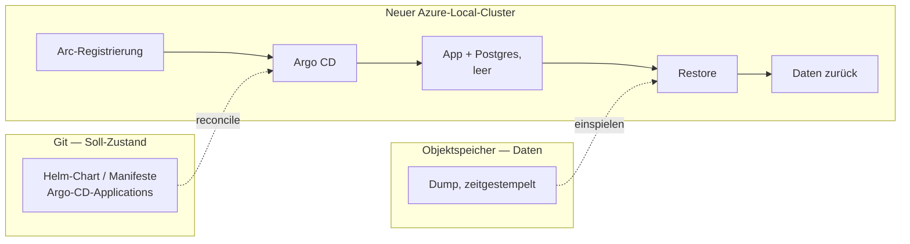

# ADR-0007: Backup und Wiederherstellung über Objektspeicher (Entwurf)

- **Status:** Entwurf — noch nicht mit dem Team abgestimmt, kein `accepted`
- **Datum:** 2026-08-25
- **Betrifft:** Deployment, Betrieb, Daten
- **Phase:** phase-2. Kubernetes-Deployment ist in `docs/mvp-plan.md` unter
  "Bewusst nicht enthalten" aufgeführt — dieses ADR greift dem nicht vor,
  sondern hält fest, was gilt, sobald die Phase erreicht ist.
- **Verwandt:** ADR-0006 (Deployment-Ziel), ADR-0001 (Postgres), ADR-0004
  (WebAuthn), ADR-0005 (Custom Resources als Datenspeicher)

## Der laufenden Messung nicht in die Quere kommen

Die MVP-Messung aus #7 läuft ab dem 2026-08-26 und ist frühestens am
2026-09-01 ablesbar (#68). Sie hängt an genau einer Installation: dem Rechner
im Büro, gestartet über `task office:up`.

**Nichts aus diesem ADR und nichts aus ADR-0006 wird umgesetzt, solange die
Messung läuft.** Ein zweites Deployment derselben Anwendung während des
Messzeitraums erzeugt entweder einen zweiten Datenbestand oder verleitet dazu,
den laufenden anzufassen — beides macht die Messung wertlos, und die Messung
ist der Grund, warum es die Anwendung gibt.

Issue #43 (`mvp`) ist davon ausdrücklich nicht betroffen: "irgendwo hinstellen,
wo das Büro drankommt" meint die einfachste Lösung, die die Messung ermöglicht,
nicht ein Cluster-Deployment. Die beiden Vorhaben sehen ähnlich aus und sind es
nicht.

## Kontext

Die Zielumgebung aus ADR-0006 ist ein Azure-Local-Cluster. Dieser Cluster wird
nicht als dauerhaft angenommen: Er wird gelegentlich neu aufgebaut, und
währenddessen steht die Infrastruktur nicht zur Verfügung. Ein Neubau ist damit
ein *geplantes* Ereignis, kein Störfall — aber eines, das ohne Vorkehrung alle
Daten mitnimmt.

Betroffen sind fünf Tabellen (`players`, `identities`, `matches`, `match_sets`,
`ttr_history`). Der Umfang ist klein — Büro-Tischtennis, Nutzerzahl im niedrigen
zweistelligen Bereich, Datenmenge im einstelligen Megabyte-Bereich. Der Wert ist
trotzdem hoch: Die TTR-Historie ist nicht rekonstruierbar, und die
MVP-Definition-of-Done aus `docs/mvp-plan.md` misst über einen Zeitraum von fünf
Arbeitstagen. Ein Datenverlust setzt die Messung zurück, nicht nur die Daten.

## Zwei Arten von Zustand, nur eine gehört in den Objektspeicher

Die naheliegende Formulierung — "wir sichern die Infrastruktur nach S3 und
stellen sie danach daraus wieder her" — vermischt zwei Dinge mit
unterschiedlicher Datenquelle. Sie auseinanderzuhalten ist die eigentliche
Entscheidung dieses ADR.

| Was | Datenquelle | Begründung |
| --- | --- | --- |
| Soll-Zustand: Manifeste, Helm-Chart, Argo-CD-Applications, Namespaces | **Git** | Genau dafür existiert die GitOps-Schicht aus ADR-0006. Eine Kopie davon im Objektspeicher wäre eine zweite Wahrheit und würde die Entscheidung entwerten. |
| Anwendungsdaten: der Inhalt der Postgres-Datenbank | **Objektspeicher** | Das Einzige, was Git nicht wiederherstellen kann. |

Der Neubau läuft damit in zwei Strängen, die erst im neuen Cluster
zusammenlaufen:

## Entscheidung

*Vorschlag zur Diskussion, noch nicht beschlossen.*

**Der Zustand der Anwendung wird als logischer Datenbank-Dump in einen
Objektspeicher außerhalb des Clusters gesichert. Der Restore ist ein eigener,
bewusster Schritt nach dem Neubau — kein Bootstrap-Modus der Datenbank.**

Dagegen wird ein Postgres-Operator mit kontinuierlichem WAL-Archiving
(CloudNativePG) *nicht* eingeführt, solange keiner der unten genannten Auslöser
eintritt. Das folgt dem Muster aus ADR-0002: die schwerere Lösung benannt und
vorbereitet, aber nicht ohne Anlass gebaut.

### Die drei erwogenen Wege

| | Mechanik | Preis | RPO |
| --- | --- | --- | --- |
| **A — Dump/Restore** *(gewählt)* | Geplanter Job erzeugt einen Dump und legt ihn im Objektspeicher ab. Nach dem Neubau spielt ein Job den jüngsten Dump ein. | Nahezu nichts. Kein Operator, keine neue Betriebskomponente. | Dump-Intervall |
| **B — CloudNativePG** | Operator mit kontinuierlichem WAL-Archiving. Der neue Cluster startet mit `bootstrap.recovery` gegen denselben Objektspeicher und zieht sich selbst hoch. | Ein Operator mehr. Die Datenbank ist kein einfacher Container mehr. | nahe null, Point-in-Time-Recovery |
| **C — Velero mit CSI-Snapshots** | Sichert ganze Namespaces samt PersistentVolumes. | Setzt CSI-Snapshot-Unterstützung auf Azure Local voraus. Volume-Snapshots einer laufenden Datenbank sind crash-, nicht anwendungskonsistent. | Schedule |

Weg B beschreibt wörtlich das ursprünglich angedachte Bild — der Objektspeicher
als Datenbasis, aus der sich der neue Cluster selbst herstellt. Er ist der
technisch elegantere Weg und bleibt das benannte Ziel. Weg A wird trotzdem
zuerst gebaut:

- **Ein geplanter Neubau ist kein Datenverlust.** Vor dem Teardown lässt sich
  ein letzter Dump ziehen, damit ist der RPO für genau den Fall, um den es hier
  geht, null. Das Intervall-RPO deckt nur den *ungeplanten* Verlust ab — und
  der ist bislang hypothetisch.
- **Die Datenmenge rechtfertigt die Maschinerie nicht.** Point-in-Time-Recovery
  für fünf Tabellen mit wenigen tausend Zeilen steht in keinem Verhältnis.
- **Weg A lässt sich lokal üben.** Dump und Rückspielen funktionieren gegen die
  Compose-Umgebung. Ein Recovery-Bootstrap braucht einen Cluster zum Testen —
  und damit lässt sich das Verfahren erst dann prüfen, wenn es gebraucht wird.

Weg C wird nicht verfolgt. Er sichert primär das, was ohnehin aus Git kommt, und
löst den Datenteil schlechter als A und B.

### Auslöser für den Wechsel auf Weg B

1. Ein Cluster geht **ungeplant** verloren, oder es zeichnet sich ab, dass das
   passieren kann. Dann trägt das Argument "vor dem Teardown ein Dump" nicht
   mehr.
2. Der **Ligamodus (M2)** ist in Betrieb und Tabellenstände hängen an
   Ergebnissen. Ein Verlust der letzten Stunden ist dann nicht mehr die
   Neueingabe weniger Matches, sondern eine inkonsistente Tabelle.
3. Die Datenbank soll **hochverfügbar** laufen. Dann ist ohnehin ein Operator im
   Spiel, und dessen Backup-Funktion mitzunehmen kostet nichts extra.

## Randbedingungen, die für jeden der drei Wege gelten

Diese Punkte sind unabhängig von der Wahl A/B/C und wiegen schwerer als sie.

1. **Das Ziel darf nicht auf dem Cluster liegen, der zerstört wird.** Ein
   MinIO-Deployment im selben Cluster als "unser S3" ist die naheliegende und
   falsche Lösung: Es verschwindet mit dem Cluster, den es absichern soll. Das
   Ziel muss außerhalb liegen — Azure Blob Storage oder ein Objektspeicher
   außerhalb der Azure-Local-Umgebung.

2. **Das Bootstrap-Geheimnis ist ein Henne-Ei-Problem.** Der Restore braucht
   Zugangsdaten für den Objektspeicher, und die können nicht aus dem Cluster
   kommen, den es noch nicht gibt. Etwas muss sie säen: verschlüsselt in Git
   (SOPS/age, von Argo CD entschlüsselt), External Secrets gegen Azure Key
   Vault, oder ein bewusster manueller Schritt null. **Das ist der Punkt, der
   bei einer echten Wiederherstellung tatsächlich schmerzt — nicht das Backup.**

3. **Die Reihenfolge kollidiert mit `SP_AUTO_MIGRATE`.** Der Standardwert ist
   `true`: Die Anwendung legt das Schema beim Start selbst an. Startet sie, bevor
   der Dump eingespielt ist, trifft der Dump auf ein bereits migriertes Schema.
   Zwei Auswege:
   - Der Restore läuft **vor** dem ersten Anwendungsstart (Init-Container oder
     Argo-CD-Sync-Wave).
   - Der Dump ist **`--data-only`**, das Schema kommt weiterhin aus den
     Migrations.

   Die zweite Variante ist vorzuziehen: Sie hält Invariante 8 ein — Migrations
   bleiben der einzige Weg, auf dem sich das Schema ändert — und macht den
   Restore unabhängig davon, aus welcher Version der Dump stammt.

4. **Ein Backup, das nie zurückgespielt wurde, ist keines.** Hier liegt ein
   Vorteil dieser Umgebung: Der Cluster wird ohnehin regelmäßig neu gebaut. Jeder
   Neubau ist eine kostenlose Restore-Übung. Das gehört als Ritual festgehalten,
   nicht als Ausnahmefall — die Wiederherstellung ist der Normalweg, über den der
   neue Cluster zu seinen Daten kommt, nicht ein Notfallverfahren.

## Was am Zustand hängt, aber nicht in der Datenbank steht

- **`SP_SESSION_KEY`** — signiert das Wiedererkennungs-Cookie. Ändert er sich
  beim Neubau, sind alle Cookies ungültig und jeder meldet sich neu an. Das ist
  verschmerzbar und muss nicht gesichert werden; man sollte es nur nicht für
  einen Fehler halten.

- **Der Hostname, unter dem die Anwendung erreichbar ist** — das ist der
  unangenehmere Punkt, und er reicht über dieses ADR hinaus. ADR-0004 legt uns
  auf WebAuthn fest (im Code bislang nur als geplante zweite
  `Authenticator`-Implementierung). Passkeys sind an die Relying-Party-ID
  gebunden, also an den Hostnamen. **Ändert sich die URL beim Cluster-Neubau,
  sind alle Passkeys wertlos — auch bei fehlerfreiem Datenbank-Restore.** Der
  DNS-Name muss den Neubau überleben. Das ist eine Anforderung an die
  Ingress-/Netzwerk-Entscheidung, keine ans Backup, fällt aber sonst erst auf,
  wenn WebAuthn bereits ausgeliefert ist.

## Diese Entscheidung hängt an ADR-0005

ADR-0005 hält Kubernetes Custom Resources als Speicher-Kandidaten fest — Status
`proposed`, ausdrücklich nichts entschieden. Träte dieser Kandidat je ein, wäre
dieses ADR hinfällig statt anpassbar: Ein Teil des Zustands läge dann in etcd,
und die Sicherung wäre ein etcd-Backup plus Resource-Export, nicht ein
Datenbank-Dump.

Das ist kein Grund zu warten. ADR-0005 nennt seine eigene Vorbedingung — es wird
erst zur Entscheidung, wenn jemand Invariante 1 zur Diskussion stellt, und
niemand tut das. Der Schnitt, den ADR-0005 vorschlägt, liefe ohnehin auf
"Matches und TTR-Historie bleiben in einem transaktionalen Speicher" hinaus,
und genau das ist der Teil, den dieses ADR sichert. Der Dump-Weg bliebe also
auch dann tragfähig.

Festgehalten trotzdem, damit die Verbindung nicht erst auffällt, wenn jemand
ADR-0005 aufgreift.

## Offene Fragen

1. **Welcher Objektspeicher konkret?** Azure Blob Storage liegt nahe, weil die
   Umgebung ohnehin an Azure hängt. Zu klären, ob im
   stuttgart-things-Umfeld schon ein Objektspeicher existiert, der die
   Anforderung aus Randbedingung 1 erfüllt.
2. **Wie wird das Bootstrap-Geheimnis gesät?** Siehe Randbedingung 2. Diese
   Frage ist gemeinsam mit der GitOps-Entscheidung aus ADR-0006 zu beantworten,
   nicht getrennt davon.
3. **Wie oft wird gesichert?** Der Wert folgt aus der Antwort auf "wie viel
   Neueingabe ist im schlimmsten Fall zumutbar". Vor jedem geplanten Teardown
   zusätzlich ein Dump von Hand, unabhängig vom Intervall.
4. **Wie viele Dumps werden aufbewahrt, und wie lange?** Betrifft auch die
   Frage, ob Ergebnisdaten einer Aufbewahrungsgrenze unterliegen sollen.
5. **Gehört ein `task`-Ziel dazu?** Der `office:`-Namensraum zeigt, dass
   Betriebsbefehle in diesem Projekt als Task existieren. Ein Ziel, das den
   Dump von Hand zieht, wäre die naheliegende Ergänzung — und wäre auch der
   Weg, das Verfahren lokal zu üben.

## Konsequenzen

- **Positiv:** Der Cluster-Neubau verliert seinen Schrecken. Git stellt die
  Infrastruktur her, der Objektspeicher die Daten, beide Wege sind einzeln
  prüfbar.
- **Positiv:** Kein zusätzlicher Operator, keine neue Betriebskomponente. Die
  Datenbank bleibt ein gewöhnlicher Postgres-Container, wie in ADR-0001
  angenommen.
- **Positiv:** Der Restore-Weg wird bei jedem Neubau begangen und verrottet
  deshalb nicht.
- **Negativ:** Zwischen zwei Dumps liegt ein Fenster, in dem Ergebnisse verloren
  gehen können. Bei einem geplanten Neubau lässt sich das auf null drücken, bei
  einem ungeplanten Verlust nicht.
- **Negativ:** Der Wechsel auf Weg B ist später nicht kostenlos — der
  Objektspeicher-Inhalt aus Weg A ist für einen CNPG-Recovery-Bootstrap nicht
  verwendbar, ein Umstieg beginnt mit einem frischen Backup-Bestand.
- **Risiko:** Als Entwurf steht das unter demselben Vorbehalt wie ADR-0006 —
  echte Constraints aus Azure Local (verfügbare CSI-Treiber, erreichbare
  Objektspeicher, Secret-Verwaltung) können das noch verschieben.

## Hinweis für später

Falls Weg B kommt: CloudNativePG hat die Barman-Cloud-Anbindung aus dem Kern in
ein eigenes Plugin ausgelagert; das eingebaute `barmanObjectStore` im
`Cluster`-CR gilt als veraltet. Beim Aufsetzen gleich den Plugin-Weg nehmen und
gegen die dann aktuelle Dokumentation prüfen, statt der älteren Anleitungen zu
folgen, die noch das Feld im CR zeigen.
