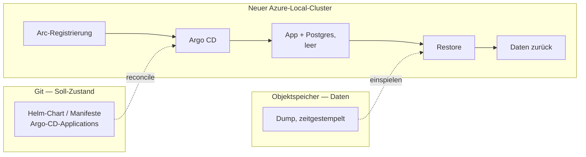

# ADR: Backup und Wiederherstellung über Objektspeicher (Entwurf)

- **Status:** Entwurf — noch nicht mit dem Team abgestimmt, kein `accepted`
- **Nummer:** noch nicht vergeben. Wird beim Merge zugeteilt; bis dahin trägt
  der Dateiname `XXXX`. Grund: Auf `main` entstehen parallel ADRs, und zwei
  gleich nummerierte Dateien mit verschiedenen Namen mergen konfliktfrei —
  Git meldet das nicht.
- **Datum:** 2026-08-25
- **Betrifft:** Deployment, Betrieb, Daten
- **Phase:** phase-5, entsprechend #84. Nichts hiervon wird vorgezogen: Vor
  #78 und #81 gibt es keinen CloudNativePG-Cluster, der gesichert werden
  könnte. Die ursprüngliche Einordnung als phase-2 war eine Fehleinschätzung
  des Zeitpunkts, nicht des Inhalts.
- **Verwandt:** das Deployment-Ziel-ADR aus demselben Branch, ADR-0001
  (Postgres), ADR-0004 (WebAuthn), ADR-0005 (Custom Resources als Datenspeicher)

## Der laufenden Messung nicht in die Quere kommen

Die MVP-Messung aus #7 läuft ab dem 2026-08-26 und ist frühestens am
2026-09-01 ablesbar (#68). Sie hängt an genau einer Installation: dem Rechner
im Büro, gestartet über `task office:up`.

**Nichts aus diesem ADR und nichts aus dem Deployment-Ziel-ADR wird umgesetzt,
solange die
Messung läuft.** Ein zweites Deployment derselben Anwendung während des
Messzeitraums erzeugt entweder einen zweiten Datenbestand oder verleitet dazu,
den laufenden anzufassen — beides macht die Messung wertlos, und die Messung
ist der Grund, warum es die Anwendung gibt.

Issue #43 (`mvp`) ist davon ausdrücklich nicht betroffen: "irgendwo hinstellen,
wo das Büro drankommt" meint die einfachste Lösung, die die Messung ermöglicht,
nicht ein Cluster-Deployment. Die beiden Vorhaben sehen ähnlich aus und sind es
nicht.

## Kontext

Die Zielumgebung aus dem Deployment-Ziel-ADR ist ein Azure-Local-Cluster. Dieser Cluster wird
nicht als dauerhaft angenommen: Er wird gelegentlich neu aufgebaut, und
währenddessen steht die Infrastruktur nicht zur Verfügung. Ein Neubau ist damit
ein *geplantes* Ereignis, kein Störfall — aber eines, das ohne Vorkehrung alle
Daten mitnimmt.

Betroffen sind fünf Tabellen (`players`, `identities`, `matches`, `match_sets`,
`ttr_history`). Der Umfang ist klein — Büro-Tischtennis, Nutzerzahl im niedrigen
zweistelligen Bereich, Datenmenge im einstelligen Megabyte-Bereich. Der Wert ist
trotzdem hoch: Die TTR-Historie ist nicht rekonstruierbar, und die
MVP-Definition-of-Done aus `docs/mvp-plan.md` misst über einen Zeitraum von fünf
Arbeitstagen. Ein Datenverlust setzt die Messung zurück, nicht nur die Daten.

## Zwei Arten von Zustand, nur eine gehört in den Objektspeicher

Die naheliegende Formulierung — "wir sichern die Infrastruktur nach S3 und
stellen sie danach daraus wieder her" — vermischt zwei Dinge mit
unterschiedlicher Datenquelle. Sie auseinanderzuhalten ist die eigentliche
Entscheidung dieses ADR.

| Was | Datenquelle | Begründung |
| --- | --- | --- |
| Soll-Zustand: Manifeste, Helm-Chart, Argo-CD-Applications, Namespaces | **Git** | Genau dafür existiert die GitOps-Schicht aus dem Deployment-Ziel-ADR. Eine Kopie davon im Objektspeicher wäre eine zweite Wahrheit und würde die Entscheidung entwerten. |
| Anwendungsdaten: der Inhalt der Postgres-Datenbank | **Objektspeicher** | Das Einzige, was Git nicht wiederherstellen kann. |

Der Neubau läuft damit in zwei Strängen, die erst im neuen Cluster
zusammenlaufen:

## Entscheidung

*Vorschlag zur Diskussion, noch nicht beschlossen. Gegenüber der ersten Fassung
neu geschnitten — siehe den Abschnitt darunter.*

**Der Zustand der Anwendung wird in einen Objektspeicher außerhalb des Clusters
gesichert, und der Restore ist ein eigener, bewusster Schritt nach dem Neubau —
kein Bootstrap-Modus der Datenbank.** Das bleibt.

Was nicht bleibt, ist die Begründung. Diese Fassung argumentierte gegen
CloudNativePG mit dem Muster aus ADR-0002: die schwerere Lösung benennen, aber
nicht ohne Anlass bauen. **Dieses Argument ist hinfällig — #78 setzt
CloudNativePG als Betriebsweise der Datenbank, nicht als Backup-Entscheidung.**
Der Operator ist ohnehin da. „Kein Operator" ist damit kein Preis mehr, den man
sparen kann.

### Die Wege, neu geschnitten

Damit läuft der Vergleich nicht mehr zwischen „Dump" und „Operator", sondern
zwischen zwei Arten, denselben Operator zu sichern. #84 hat denselben Schnitt
unabhängig gefunden und ihn als Vergleich mit Messkriterien angelegt:

| | Mechanik | Preis | RPO |
| --- | --- | --- | --- |
| **A — Velero mit Dump-Hook** | Velero sichert den Namespace; ein `hooks.resources[]`-Eintrag lässt vorher `pg_dump` im CNPG-Pod laufen, der Dump liegt auf dem mitgesicherten Volume | Ein System statt zwei — Velero wird ohnehin betrieben | Schedule |
| **B — barman-cloud** | CNPG-Plugin schiebt Basisbackup und WAL laufend in den Objektspeicher; der neue Cluster zieht sich mit `bootstrap.recovery` selbst hoch | Ein zweites Backup-System neben Velero | nahe null, Point-in-Time-Recovery |

Was aus der ersten Fassung **erhalten bleibt**: Weg B beschreibt wörtlich das
ursprünglich angedachte Bild — der Objektspeicher als Datenbasis, aus der sich
der neue Cluster selbst herstellt. Und der Grund, ihn trotzdem nicht zuerst zu
bauen, trägt weiter: Ein geplanter Neubau ist kein Datenverlust, weil sich vor
dem Teardown ein letzter Sicherungslauf ziehen lässt. Das Intervall-RPO deckt
nur den *ungeplanten* Verlust ab, und der ist bislang hypothetisch.

Was **wegfällt**: „Weg A lässt sich lokal üben." Ein Velero-Hook lässt sich
gegen die Compose-Umgebung nicht üben — der Vorteil gehörte dem
Dump-Job-Entwurf, nicht dem Velero-Weg. `task office:backup` bleibt davon
unberührt und deckt den lokalen Fall weiterhin ab.

Was **neu dazukommt** und in #84 noch fehlt: **Auf AKS enabled by Azure Arc
gibt es keine Volume-Snapshots.** Velero muss dort auf Datei-Backup (restic
beziehungsweise kopia) ausweichen. Weg A funktioniert also, aber nicht so, wie
#84 ihn beschreibt — das ändert Laufzeit und Wiederherstellungsdauer und damit
zwei der Messkriterien, bevor der Vergleich überhaupt läuft. Auf der
Übergangsumgebung stellt sich die Frage nicht.

### Die Entscheidungsregel

Von #84 übernommen, weil sie richtig ist und vorher feststehen soll:
**Weg A, es sei denn, er fällt bei einem Kriterium durch, das zählt.** Der
Ausschlag gibt „ein System statt zwei" — ein Zeitplan, ein Bucket, eine Stelle
zum Nachsehen, ob er gelaufen ist. Weg B, wenn der Restore messbar schneller
oder kürzer ist, oder wenn A sich im Versuch mit dem Operator beißt.

**Point-in-Time-Recovery ist kein Kriterium.** „Letzte Nacht" ist hier die
richtige Auflösung; niemand stellt diese Datenbank auf 14:32 zurück.

### Auslöser, die den Vergleich vorziehen

Unverändert gültig, jetzt als Auslöser für „Weg B ernst nehmen" statt für
„überhaupt einen Operator einführen":

1. Ein Cluster geht **ungeplant** verloren, oder es zeichnet sich ab, dass das
   passieren kann. Dann trägt das Argument „vor dem Teardown ein Lauf" nicht
   mehr.
2. Der **Ligamodus (M2)** ist in Betrieb und Tabellenstände hängen an
   Ergebnissen. Ein Verlust der letzten Stunden ist dann nicht mehr die
   Neueingabe weniger Matches, sondern eine inkonsistente Tabelle.
3. Die Datenbank soll **hochverfügbar** laufen.

## Randbedingungen, die für jeden der drei Wege gelten

Diese Punkte sind unabhängig von der Wahl A/B/C und wiegen schwerer als sie.

1. **Das Ziel darf nicht auf dem Cluster liegen, der zerstört wird.** Ein
   MinIO-Deployment im selben Cluster als "unser S3" ist die naheliegende und
   falsche Lösung: Es verschwindet mit dem Cluster, den es absichern soll. Das
   Ziel muss außerhalb liegen — Azure Blob Storage oder ein Objektspeicher
   außerhalb der Azure-Local-Umgebung.

2. **Das Bootstrap-Geheimnis ist ein Henne-Ei-Problem.** Der Restore braucht
   Zugangsdaten für den Objektspeicher, und die können nicht aus dem Cluster
   kommen, den es noch nicht gibt. Etwas muss sie säen: verschlüsselt in Git
   (SOPS/age, von Argo CD entschlüsselt), External Secrets gegen Azure Key
   Vault, oder ein bewusster manueller Schritt null. **Das ist der Punkt, der
   bei einer echten Wiederherstellung tatsächlich schmerzt — nicht das Backup.**

3. **Die Reihenfolge kollidiert mit `SP_AUTO_MIGRATE`.** Der Standardwert ist
   `true`: Die Anwendung legt das Schema beim Start selbst an. Startet sie, bevor
   der Dump eingespielt ist, trifft der Dump auf ein bereits migriertes Schema.
   Zwei Auswege:
   - Der Restore läuft **vor** dem ersten Anwendungsstart (Init-Container oder
     Argo-CD-Sync-Wave).
   - Der Dump ist **`--data-only`**, das Schema kommt weiterhin aus den
     Migrations.

   Die zweite Variante ist vorzuziehen: Sie hält Invariante 8 ein — Migrations
   bleiben der einzige Weg, auf dem sich das Schema ändert — und macht den
   Restore unabhängig davon, aus welcher Version der Dump stammt.

4. **Ein Backup, das nie zurückgespielt wurde, ist keines.** Hier liegt ein
   Vorteil dieser Umgebung: Der Cluster wird ohnehin regelmäßig neu gebaut. Jeder
   Neubau ist eine kostenlose Restore-Übung. Das gehört als Ritual festgehalten,
   nicht als Ausnahmefall — die Wiederherstellung ist der Normalweg, über den der
   neue Cluster zu seinen Daten kommt, nicht ein Notfallverfahren.

## Was am Zustand hängt, aber nicht in der Datenbank steht

- **`SP_SESSION_KEY`** — signiert das Wiedererkennungs-Cookie. Ändert er sich
  beim Neubau, sind alle Cookies ungültig und jeder meldet sich neu an. Das ist
  verschmerzbar und muss nicht gesichert werden; man sollte es nur nicht für
  einen Fehler halten.

- **Der Hostname, unter dem die Anwendung erreichbar ist** — das ist der
  unangenehmere Punkt, und er reicht über dieses ADR hinaus. ADR-0004 legt uns
  auf WebAuthn fest (im Code bislang nur als geplante zweite
  `Authenticator`-Implementierung). Passkeys sind an die Relying-Party-ID
  gebunden, also an den Hostnamen. **Ändert sich die URL beim Cluster-Neubau,
  sind alle Passkeys wertlos — auch bei fehlerfreiem Datenbank-Restore.** Der
  DNS-Name muss den Neubau überleben. Das ist eine Anforderung an die
  Ingress-/Netzwerk-Entscheidung, keine ans Backup, fällt aber sonst erst auf,
  wenn WebAuthn bereits ausgeliefert ist.

## Diese Entscheidung hängt an ADR-0005

ADR-0005 hält Kubernetes Custom Resources als Speicher-Kandidaten fest — Status
`proposed`, ausdrücklich nichts entschieden. Träte dieser Kandidat je ein, wäre
dieses ADR hinfällig statt anpassbar: Ein Teil des Zustands läge dann in etcd,
und die Sicherung wäre ein etcd-Backup plus Resource-Export, nicht ein
Datenbank-Dump.

Das ist kein Grund zu warten. ADR-0005 nennt seine eigene Vorbedingung — es wird
erst zur Entscheidung, wenn jemand Invariante 1 zur Diskussion stellt, und
niemand tut das. Der Schnitt, den ADR-0005 vorschlägt, liefe ohnehin auf
"Matches und TTR-Historie bleiben in einem transaktionalen Speicher" hinaus,
und genau das ist der Teil, den dieses ADR sichert. Der Dump-Weg bliebe also
auch dann tragfähig.

Festgehalten trotzdem, damit die Verbindung nicht erst auffällt, wenn jemand
ADR-0005 aufgreift.

## Offene Fragen

1. **Welcher Objektspeicher konkret?** Azure Blob Storage liegt nahe, weil die
   Umgebung ohnehin an Azure hängt. Zu klären, ob im
   stuttgart-things-Umfeld schon ein Objektspeicher existiert, der die
   Anforderung aus Randbedingung 1 erfüllt.
2. **Wie wird das Bootstrap-Geheimnis gesät?** Siehe Randbedingung 2. Diese
   Frage ist gemeinsam mit der GitOps-Entscheidung aus dem Deployment-Ziel-ADR zu
   beantworten,
   nicht getrennt davon.
3. **Wie oft wird gesichert?** Der Wert folgt aus der Antwort auf "wie viel
   Neueingabe ist im schlimmsten Fall zumutbar". Vor jedem geplanten Teardown
   zusätzlich ein Dump von Hand, unabhängig vom Intervall.
4. **Wie viele Dumps werden aufbewahrt, und wie lange?** Betrifft auch die
   Frage, ob Ergebnisdaten einer Aufbewahrungsgrenze unterliegen sollen.
5. **Wie verhält sich das zu `task office:backup`?** Das Ziel existiert seit
   dem 2026-08-22 und macht bereits das Richtige: `pg_dump` der laufenden
   Datenbank in eine nach dem Zeitpunkt benannte Datei. Es fehlt nur der
   zweite Schritt — die Datei landet neben dem Repository, nicht im
   Objektspeicher, und überlebt damit den Rechner nicht, auf dem sie
   entstanden ist.

   Das ist eine gute Ausgangslage, keine Doppelarbeit: Der Weg für den
   geplanten Neubau ist damit schon gebaut und im Betrieb erprobt. Zu klären
   ist, ob der Upload ein eigenes Ziel wird (`office:backup:push`) oder ob
   `office:backup` ihn übernimmt, sobald Zugangsdaten gesetzt sind. Für die
   Variante aus Randbedingung 3 käme `--data-only` als Option dazu.

## Konsequenzen

- **Positiv:** Der Cluster-Neubau verliert seinen Schrecken. Git stellt die
  Infrastruktur her, der Objektspeicher die Daten, beide Wege sind einzeln
  prüfbar.
- **Positiv:** Kein zusätzlicher Operator, keine neue Betriebskomponente. Die
  Datenbank bleibt ein gewöhnlicher Postgres-Container, wie in ADR-0001
  angenommen.
- **Positiv:** Der Restore-Weg wird bei jedem Neubau begangen und verrottet
  deshalb nicht.
- **Negativ:** Zwischen zwei Dumps liegt ein Fenster, in dem Ergebnisse verloren
  gehen können. Bei einem geplanten Neubau lässt sich das auf null drücken, bei
  einem ungeplanten Verlust nicht.
- **Negativ:** Der Wechsel auf Weg B ist später nicht kostenlos — der
  Objektspeicher-Inhalt aus Weg A ist für einen CNPG-Recovery-Bootstrap nicht
  verwendbar, ein Umstieg beginnt mit einem frischen Backup-Bestand.
- **Risiko:** Als Entwurf steht das unter demselben Vorbehalt wie das
  Deployment-Ziel-ADR —
  echte Constraints aus Azure Local (verfügbare CSI-Treiber, erreichbare
  Objektspeicher, Secret-Verwaltung) können das noch verschieben.

## Hinweis für später

Falls Weg B kommt: CloudNativePG hat die Barman-Cloud-Anbindung aus dem Kern in
ein eigenes Plugin ausgelagert; das eingebaute `barmanObjectStore` im
`Cluster`-CR gilt als veraltet. Beim Aufsetzen gleich den Plugin-Weg nehmen und
gegen die dann aktuelle Dokumentation prüfen, statt der älteren Anleitungen zu
folgen, die noch das Feld im CR zeigen.
