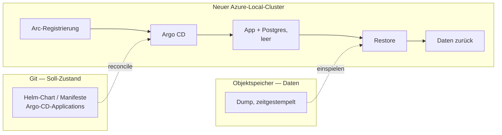

# ADR: Backup und Wiederherstellung über Objektspeicher (Entwurf)

- **Status:** Entwurf — noch nicht mit dem Team abgestimmt, kein `accepted`
- **Nummer:** noch nicht vergeben. Wird beim Merge zugeteilt; bis dahin trägt
  der Dateiname `XXXX`. Grund: Auf `main` entstehen parallel ADRs, und zwei
  gleich nummerierte Dateien mit verschiedenen Namen mergen konfliktfrei —
  Git meldet das nicht.
- **Datum:** 2026-08-25
- **Betrifft:** Deployment, Betrieb, Daten
- **Phase:** phase-5, entsprechend #84. Nichts hiervon wird vorgezogen: Vor
  #78 und #81 gibt es keinen CloudNativePG-Cluster, der gesichert werden
  könnte. Die ursprüngliche Einordnung als phase-2 war eine Fehleinschätzung
  des Zeitpunkts, nicht des Inhalts.
- **Verwandt:** das Deployment-Ziel-ADR aus demselben Branch, ADR-0001
  (Postgres), ADR-0004 (WebAuthn), ADR-0005 (Custom Resources als Datenspeicher)

## Der Office-Installation nicht in die Quere kommen

Die erste Fassung sperrte dieses ADR und das Deployment-Ziel-ADR pauschal, bis
die MVP-Messung aus #7 abgelesen ist. Diese Sperre war zu breit gefasst. #89
hält Phase 3 ausdrücklich unabhängig von der Messung: Eine enttäuschende Zahl
entscheidet, wozu die Anwendung wird, nicht ob sie auf Kubernetes läuft.

**Was bleibt, ist die schmalere und dauerhaftere Fassung**, und sie steht in
#89 als Punkt 3 der Definition of Done: *`task office:up` auf einem Laptop
funktioniert weiterhin unverändert.* Der Rechner im Büro trägt die Messung, und
er trägt sie unabhängig davon, was im Cluster passiert.

**Der Zeitplan dazu hat sich verschoben, und das ist keine Randnotiz.** Der
Lauf vom 2026-08-26 ist für ungültig erklärt (#7, #68): #70 — wer sein Cookie
verliert, kommt nicht mehr an den eigenen Spieler — hat während des Laufs so
oft zugeschlagen, dass Ergebnisse nicht verlässlich von denen eingetragen
wurden, die sie gespielt haben. Gezählt wurde damit etwas anderes als das, was
#7 fragt.

Das neue Fenster läuft **2026-08-31 bis 2026-09-04**, ablesbar am 2026-09-04,
und es läuft erst, seit Phase 2 gelandet ist (#98, #100, #101, #103) — vorher
gab es keinen Weg zurück in den eigenen Spieler. Zwei Auflagen sind aus dem
gescheiterten Lauf dazugekommen: am ersten Morgen prüfen, ob die Identität
einen Browser-Neustart übersteht, und die gezählten Tage **ohne**
`SP_KIOSK_TOKEN` fahren (#90).

Für dieses ADR ist der Punkt ohnehin entschärft: Als phase-5 kommt es zeitlich
weit nach allem, was die Messung berühren könnte.

Issue #43 (`mvp`) bleibt davon ausdrücklich unberührt: „irgendwo hinstellen, wo
das Büro drankommt" meint die einfachste Lösung, die die Messung ermöglicht,
nicht ein Cluster-Deployment. Die beiden Vorhaben sehen ähnlich aus und sind es
nicht.

## Kontext

Die Zielumgebung aus dem Deployment-Ziel-ADR ist ein Azure-Local-Cluster. Dieser Cluster wird
nicht als dauerhaft angenommen: Er wird gelegentlich neu aufgebaut, und
währenddessen steht die Infrastruktur nicht zur Verfügung. Ein Neubau ist damit
ein *geplantes* Ereignis, kein Störfall — aber eines, das ohne Vorkehrung alle
Daten mitnimmt.

Betroffen sind fünf Tabellen (`players`, `identities`, `matches`, `match_sets`,
`ttr_history`). Der Umfang ist klein — Büro-Tischtennis, Nutzerzahl im niedrigen
zweistelligen Bereich, Datenmenge im einstelligen Megabyte-Bereich. Der Wert ist
trotzdem hoch: Die TTR-Historie ist nicht rekonstruierbar, und die
MVP-Definition-of-Done aus `docs/mvp-plan.md` misst über einen Zeitraum von fünf
Arbeitstagen. Ein Datenverlust setzt die Messung zurück, nicht nur die Daten.

## Zwei Arten von Zustand, nur eine gehört in den Objektspeicher

Die naheliegende Formulierung — "wir sichern die Infrastruktur nach S3 und
stellen sie danach daraus wieder her" — vermischt zwei Dinge mit
unterschiedlicher Datenquelle. Sie auseinanderzuhalten ist die eigentliche
Entscheidung dieses ADR.

| Was | Datenquelle | Begründung |
| --- | --- | --- |
| Soll-Zustand: Manifeste, Helm-Chart, Argo-CD-Applications, Namespaces | **Git** | Genau dafür existiert die GitOps-Schicht aus dem Deployment-Ziel-ADR. Eine Kopie davon im Objektspeicher wäre eine zweite Wahrheit und würde die Entscheidung entwerten. |
| Anwendungsdaten: der Inhalt der Postgres-Datenbank | **Objektspeicher** | Das Einzige, was Git nicht wiederherstellen kann. |

Der Neubau läuft damit in zwei Strängen, die erst im neuen Cluster
zusammenlaufen:

## Entscheidung

*Vorschlag zur Diskussion, noch nicht beschlossen. Gegenüber der ersten Fassung
neu geschnitten — siehe den Abschnitt darunter.*

**Der Zustand der Anwendung wird in einen Objektspeicher außerhalb des Clusters
gesichert, und der Restore ist ein eigener, bewusster Schritt nach dem Neubau —
kein Bootstrap-Modus der Datenbank.** Das bleibt.

Was nicht bleibt, ist die Begründung. Diese Fassung argumentierte gegen
CloudNativePG mit dem Muster aus ADR-0002: die schwerere Lösung benennen, aber
nicht ohne Anlass bauen. **Dieses Argument ist hinfällig — #78 setzt
CloudNativePG als Betriebsweise der Datenbank, nicht als Backup-Entscheidung.**
Der Operator ist ohnehin da. „Kein Operator" ist damit kein Preis mehr, den man
sparen kann.

### Die Wege, neu geschnitten

Damit läuft der Vergleich nicht mehr zwischen „Dump" und „Operator", sondern
zwischen zwei Arten, denselben Operator zu sichern. #84 hat denselben Schnitt
unabhängig gefunden und ihn als Vergleich mit Messkriterien angelegt:

| | Mechanik | Preis | RPO |
| --- | --- | --- | --- |
| **A — Velero mit Dump-Hook** | Velero sichert den Namespace; ein `hooks.resources[]`-Eintrag lässt vorher `pg_dump` im CNPG-Pod laufen, der Dump liegt auf dem mitgesicherten Volume | Ein System statt zwei — Velero wird ohnehin betrieben | Schedule |
| **B — barman-cloud** | CNPG-Plugin schiebt Basisbackup und WAL laufend in den Objektspeicher; der neue Cluster zieht sich mit `bootstrap.recovery` selbst hoch | Ein zweites Backup-System neben Velero | nahe null, Point-in-Time-Recovery |

Was aus der ersten Fassung **erhalten bleibt**: Weg B beschreibt wörtlich das
ursprünglich angedachte Bild — der Objektspeicher als Datenbasis, aus der sich
der neue Cluster selbst herstellt. Und der Grund, ihn trotzdem nicht zuerst zu
bauen, trägt weiter: Ein geplanter Neubau ist kein Datenverlust, weil sich vor
dem Teardown ein letzter Sicherungslauf ziehen lässt. Das Intervall-RPO deckt
nur den *ungeplanten* Verlust ab, und der ist bislang hypothetisch.

Was **wegfällt**: „Weg A lässt sich lokal üben." Ein Velero-Hook lässt sich
gegen die Compose-Umgebung nicht üben — der Vorteil gehörte dem
Dump-Job-Entwurf, nicht dem Velero-Weg. `task office:backup` bleibt davon
unberührt und deckt den lokalen Fall weiterhin ab.

Was **neu dazukommt** und in #84 noch fehlt: **Auf AKS enabled by Azure Arc
gibt es keine Volume-Snapshots.** Velero muss dort auf Datei-Backup (restic
beziehungsweise kopia) ausweichen. Weg A funktioniert also, aber nicht so, wie
#84 ihn beschreibt — das ändert Laufzeit und Wiederherstellungsdauer und damit
zwei der Messkriterien, bevor der Vergleich überhaupt läuft. Auf der
Übergangsumgebung stellt sich die Frage nicht.

### Die Entscheidungsregel

Von #84 übernommen, weil sie richtig ist und vorher feststehen soll:
**Weg A, es sei denn, er fällt bei einem Kriterium durch, das zählt.** Der
Ausschlag gibt „ein System statt zwei" — ein Zeitplan, ein Bucket, eine Stelle
zum Nachsehen, ob er gelaufen ist. Weg B, wenn der Restore messbar schneller
oder kürzer ist, oder wenn A sich im Versuch mit dem Operator beißt.

**Point-in-Time-Recovery ist kein Kriterium.** „Letzte Nacht" ist hier die
richtige Auflösung; niemand stellt diese Datenbank auf 14:32 zurück.

### Auslöser, die den Vergleich vorziehen

Unverändert gültig, jetzt als Auslöser für „Weg B ernst nehmen" statt für
„überhaupt einen Operator einführen":

1. Ein Cluster geht **ungeplant** verloren, oder es zeichnet sich ab, dass das
   passieren kann. Dann trägt das Argument „vor dem Teardown ein Lauf" nicht
   mehr.
2. Der **Ligamodus (M2)** ist in Betrieb und Tabellenstände hängen an
   Ergebnissen. Ein Verlust der letzten Stunden ist dann nicht mehr die
   Neueingabe weniger Matches, sondern eine inkonsistente Tabelle.
3. Die Datenbank soll **hochverfügbar** laufen.

## Randbedingungen, die für beide Wege gelten

Diese Punkte sind unabhängig von der Wahl A/B und wiegen schwerer als sie.

1. **Das Ziel darf nicht auf dem Cluster liegen, der zerstört wird.** Ein
   MinIO-Deployment im selben Cluster als „unser S3" ist die naheliegende und
   falsche Lösung: Es verschwindet mit dem Cluster, den es absichern soll.

   Auf Azure Local erfüllt sich die Bedingung von selbst, allerdings aus einem
   unbequemen Grund: **Azure Local bringt keinen S3-Dienst mit.** Es bleibt
   Azure Blob Storage, und das liegt außerhalb — mitsamt der Folge, dass jeder
   Sicherungslauf und jede Wiederherstellung am WAN-Link hängt. Auf der
   Übergangsumgebung dagegen ist der naheliegende Kandidat der Bucket, den
   Velero dort schon benutzt (`infra/velero`, #84 tippt darauf); dort ist die
   Bedingung *nicht* automatisch erfüllt und muss geprüft werden.

2. **Das Bootstrap-Geheimnis war ein Henne-Ei-Problem** — auf der
   Zielumgebung ist es keins mehr. Der Restore braucht Zugangsdaten für den
   Objektspeicher, und die können nicht aus dem Cluster kommen, den es noch
   nicht gibt. Das galt als der Punkt, der bei einer echten Wiederherstellung
   tatsächlich schmerzt.

   **Auf Azure gibt es dafür keinen Zugangsdaten-Weg, sondern einen
   Identitäts-Weg.** Das barman-cloud-Plugin kann `inheritFromAzureAD`
   beziehungsweise die Default-Credential-Kette benutzen; Velero hat dieselbe
   Möglichkeit über eine Managed Identity. Die Umgebung liefert die Identität,
   nicht Git — es gibt schlicht kein Geheimnis zu säen.

   Auf der Übergangsumgebung bleibt die Frage offen und die alten Kandidaten
   stehen: SOPS/age in Git, External Secrets gegen Vault, oder ein bewusster
   Schritt null.

3. ~~**Die Reihenfolge kollidiert mit `SP_AUTO_MIGRATE`.**~~ — **beantwortet
   durch #78.** Im Cluster steht `SP_AUTO_MIGRATE=false` in der ConfigMap und
   `migrate up` läuft als initContainer. Die Anwendung legt das Schema also
   nicht mehr beim Start selbst an, und der Konflikt „Dump trifft auf bereits
   migriertes Schema" entsteht gar nicht erst.

   Was von dieser Randbedingung bleibt, ist die Reihenfolge *innerhalb* des
   Neubaus: Der Restore muss zwischen „Datenbank steht" und „initContainer
   migriert" liegen, oder der Dump ist `--data-only` und das Schema kommt
   weiterhin aus den Migrations. Die zweite Variante ist weiterhin
   vorzuziehen — sie hält Invariante 8 ein und macht den Restore unabhängig
   davon, aus welcher Version der Dump stammt.

4. **Ein Backup, das nie zurückgespielt wurde, ist keines.** Hier liegt ein
   Vorteil dieser Umgebung: Der Cluster wird ohnehin regelmäßig neu gebaut. Jeder
   Neubau ist eine kostenlose Restore-Übung. Das gehört als Ritual festgehalten,
   nicht als Ausnahmefall — die Wiederherstellung ist der Normalweg, über den der
   neue Cluster zu seinen Daten kommt, nicht ein Notfallverfahren.

## Was am Zustand hängt, aber nicht in der Datenbank steht

- **`SP_SESSION_KEY`** — signiert das Wiedererkennungs-Cookie. Die erste Fassung
  dieses ADR nannte einen Verlust „verschmerzbar, jeder meldet sich neu an".
  **Das war falsch, solange es keine Anmeldung gab**, auf die man sich dabei
  berufen könnte: Bis heute *ist* das Cookie die Identität. Scheitert die
  Signaturprüfung, landet jeder auf dem Beitrittsformular und legt einen
  **neuen** Spieler an, während die alte Zeile samt TTR-Historie verwaist
  danebenliegt. `TestARestartWithADifferentKeyForgetsEverybody` beweist genau
  das, und die Konfiguration hat aus demselben Grund keinen Default. #84 stuft
  den Schlüssel deshalb als so wichtig wie die Datenbank ein — zu Recht, für
  den heutigen Stand.

  **Seit dem 2026-08-28 gilt das nicht mehr, und zwar nicht mehr in der
  Zukunftsform.** Phase 2 ist gelandet (#98, #100, #101, #103):
  Wiederherstellungscode (ADR-0006) und PIN (ADR-0007) sind Code, nicht Plan.
  Ein Spieler hängt sich nach einem Schlüsselwechsel wieder an seine alte
  Zeile — aus Datenverlust wird eine Unbequemlichkeit. Das Argument, das hier
  als „gilt später" stand, gilt jetzt.

  Dazu kommt, was #78 nebenbei gelöst hat: **Der Schlüssel liegt im Tresor,
  und der Tresor ist wiederherstellbar.** `cicd-test2/data/schmetterpause`
  hält `session-key`, `kiosk-token`, `username` und `password`; die Einträge
  werden SOPS-verschlüsselt per Terraform in `stuttgart-things/argocd`
  verwaltet und sind nach einem Cluster-Neubau ein `apply` entfernt. Damit ist
  die Forderung „was den Schlüssel hält, muss selbst wiederherstellbar sein"
  auf der Übergangsumgebung erfüllt — **auf Azure Local ist sie offen**, weil
  es diesen Store dort nicht gibt.

  Zwei Dinge, die dabei nicht untergehen dürfen:

  - **Die Codes überleben den Schlüsselwechsel nur, weil ADR-0007 sie salzt.**
    ADR-0006 hatte als Alternative einen deterministischen Keyed Hash (HMAC mit
    dem Session-Key) erwogen, der einen Index erlaubt hätte; entschieden wurde
    Argon2id mit Salt pro Zeile. Mit der HMAC-Variante hätte ein
    Schlüsselwechsel *auch alle Wiederherstellungscodes* entwertet und das
    Argument oben zerstört. #89 führt diesen Fall noch als offene Möglichkeit —
    er ist entschieden, und zwar günstig.
  - **Bis #88 ausgeliefert ist, gehört der Schlüssel in dieselbe Sicherung wie
    die Datenbank.** Das ist die ganze Zeit dazwischen, und in genau der läuft
    die Messung.

- **Der Hostname, unter dem die Anwendung erreichbar ist** — das ist der
  unangenehmere Punkt, und er reicht über dieses ADR hinaus. ADR-0004 legt uns
  auf WebAuthn fest (im Code bislang nur als geplante zweite
  `Authenticator`-Implementierung). Passkeys sind an die Relying-Party-ID
  gebunden, also an den Hostnamen. **Ändert sich die URL beim Cluster-Neubau,
  sind alle Passkeys wertlos — auch bei fehlerfreiem Datenbank-Restore.** Der
  DNS-Name muss den Neubau überleben. Das ist eine Anforderung an die
  Ingress-/Netzwerk-Entscheidung, keine ans Backup, fällt aber sonst erst auf,
  wenn WebAuthn bereits ausgeliefert ist.

## Diese Entscheidung hängt an ADR-0005

ADR-0005 hält Kubernetes Custom Resources als Speicher-Kandidaten fest — Status
`proposed`, ausdrücklich nichts entschieden. Träte dieser Kandidat je ein, wäre
dieses ADR hinfällig statt anpassbar: Ein Teil des Zustands läge dann in etcd,
und die Sicherung wäre ein etcd-Backup plus Resource-Export, nicht ein
Datenbank-Dump.

Das ist kein Grund zu warten. ADR-0005 nennt seine eigene Vorbedingung — es wird
erst zur Entscheidung, wenn jemand Invariante 1 zur Diskussion stellt, und
niemand tut das. Der Schnitt, den ADR-0005 vorschlägt, liefe ohnehin auf
"Matches und TTR-Historie bleiben in einem transaktionalen Speicher" hinaus,
und genau das ist der Teil, den dieses ADR sichert. Der Dump-Weg bliebe also
auch dann tragfähig.

Festgehalten trotzdem, damit die Verbindung nicht erst auffällt, wenn jemand
ADR-0005 aufgreift.

## Offene Fragen

1. **Welcher Objektspeicher konkret?** Auf Azure Local **Azure Blob Storage** —
   eine echte Alternative gibt es dort nicht, siehe Randbedingung 1. Offen ist
   nur noch, ob im Firmenumfeld ein Storage-Account existiert, den wir
   mitbenutzen dürfen, oder ob ein eigener angelegt wird. Auf der
   Übergangsumgebung ist die Frage eine andere: dort liegt der Velero-Bucket
   nahe (#84), und dort muss Randbedingung 1 tatsächlich geprüft werden.
2. ~~**Wie wird das Bootstrap-Geheimnis gesät?**~~ — für die Zielumgebung
   beantwortet: gar nicht, es gibt keines. Managed Identity statt Zugangsdaten,
   siehe Randbedingung 2. Für die Übergangsumgebung bleibt die Frage offen und
   gehört weiterhin zur GitOps-Entscheidung, nicht neben sie.
3. **Wie oft wird gesichert?** Der Wert folgt aus der Antwort auf "wie viel
   Neueingabe ist im schlimmsten Fall zumutbar". Vor jedem geplanten Teardown
   zusätzlich ein Dump von Hand, unabhängig vom Intervall.
4. **Wie viele Dumps werden aufbewahrt, und wie lange?** Betrifft auch die
   Frage, ob Ergebnisdaten einer Aufbewahrungsgrenze unterliegen sollen.
5. **Wie verhält sich das zu `task office:backup`?** Das Ziel existiert seit
   dem 2026-08-22 und macht bereits das Richtige: `pg_dump` der laufenden
   Datenbank in eine nach dem Zeitpunkt benannte Datei. Es fehlt nur der
   zweite Schritt — die Datei landet neben dem Repository, nicht im
   Objektspeicher, und überlebt damit den Rechner nicht, auf dem sie
   entstanden ist.

   Das ist eine gute Ausgangslage, keine Doppelarbeit: Der Weg für den
   geplanten Neubau ist damit schon gebaut und im Betrieb erprobt. Zu klären
   ist, ob der Upload ein eigenes Ziel wird (`office:backup:push`) oder ob
   `office:backup` ihn übernimmt, sobald Zugangsdaten gesetzt sind. Für die
   Variante aus Randbedingung 3 käme `--data-only` als Option dazu.

## Konsequenzen

- **Positiv:** Der Cluster-Neubau verliert seinen Schrecken. Git stellt die
  Infrastruktur her, der Objektspeicher die Daten, beide Wege sind einzeln
  prüfbar.
- **Positiv:** Kein *zweites* Backup-System. CloudNativePG kommt ohnehin (#78),
  Velero läuft ohnehin — Weg A kommt mit dem aus, was da ist. Die erste Fassung
  zählte hier „kein Operator" als Gewinn; das gilt nicht mehr, und ADR-0001s
  Annahme eines gewöhnlichen Postgres-Containers ist mit #78 überholt.
- **Positiv:** Der Restore-Weg wird bei jedem Neubau begangen und verrottet
  deshalb nicht.
- **Negativ:** Zwischen zwei Sicherungsläufen liegt ein Fenster, in dem
  Ergebnisse verloren gehen können. Bei einem geplanten Neubau lässt sich das
  auf null drücken, bei einem ungeplanten Verlust nicht.
- **Negativ:** Der Wechsel auf Weg B ist später nicht kostenlos — die von Velero
  abgelegten Dumps sind für einen CNPG-Recovery-Bootstrap nicht verwendbar, ein
  Umstieg beginnt mit einem frischen Backup-Bestand.
- **Negativ, neu:** Auf der Zielumgebung hängt jeder Lauf am WAN-Link, weil
  Azure Local keinen Objektspeicher mitbringt. Bei dieser Datenmenge egal —
  festgehalten, damit es nicht als Überraschung durchgeht, falls sie wächst.
- **Risiko:** Als Entwurf steht das unter demselben Vorbehalt wie das
  Deployment-Ziel-ADR. Zwei der damals genannten Unbekannten sind inzwischen
  bekannt und beide ungünstig: Auf AKS enabled by Azure Arc gibt es keine
  Volume-Snapshots, und einen Objektspeicher gibt es dort auch nicht. Was
  offen bleibt, ist der Vergleich selbst — er ist in #84 angelegt und noch
  nicht gelaufen.

## Wenn Weg B gebaut wird, dann über das Plugin

Stand als Fußnote in der ersten Fassung und gehört nach vorne, weil Weg B jetzt
ein ernsthafter Kandidat ist statt eines fernen Ziels:

CloudNativePG hat die Barman-Cloud-Anbindung aus dem Kern in ein eigenes Plugin
ausgelagert. **Das eingebaute Feld `barmanObjectStore` im `Cluster`-CR ist seit
CNPG 1.26 deprecated, die Entfernung ist für 1.30 vorgesehen.** Der aktuelle Weg
ist das Plugin mit einem eigenen `ObjectStore`-Objekt, und nur dort steht auch
`inheritFromAzureAD` zur Verfügung, auf dem Randbedingung 2 aufbaut.

Das ist kein akademischer Hinweis: **#84 beschreibt Weg B ausdrücklich als
`spec.backup.barmanObjectStore` auf dem `Cluster` plus `ScheduledBackup`** —
also über das veraltete Feld. Wer den Vergleich aus #84 aufsetzt, ohne das zu
wissen, baut ihn gegen eine Schnittstelle, die vor der nächsten
Operator-Aktualisierung verschwindet, und misst nebenbei das falsche Verfahren.
Gehört als Kommentar dorthin.
