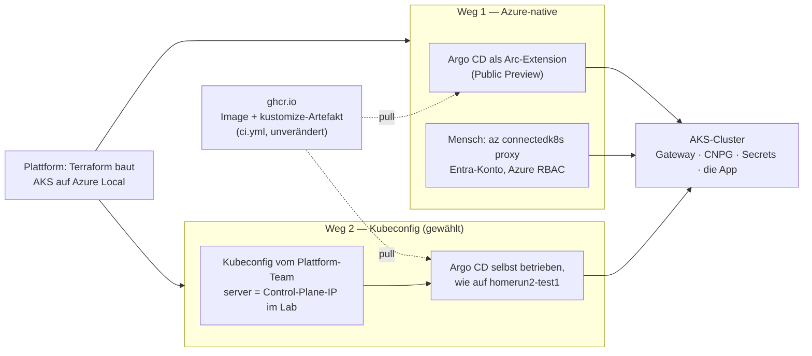

# ADR-XXXX: Azure Local ist das Ziel, und der Cluster kommt als Kubeconfig

- **Status:** proposed — Entwurf, nicht mit dem Team abgestimmt
- **Datum:** 2026-09-17
- **Betrifft:** Deployment, Betrieb
- **Bezug:** schreibt `0016-azure-auf-zeit-daten-ziehen-um` fort — dort ist
  „Kubernetes" der sthings-Cluster, hier bekommt das Wort ein zweites Ziel.
  Stützt sich auf `0019-backup-auf-kubernetes`. Ersetzt kein ADR. Die
  Cluster-Seite liegt außerhalb dieses Repos (`jannikl-punkt-cloud/azure-iac`,
  Szenario `aks-lab-ulm`).
- **Nummer:** wird beim Merge vergeben; bis dahin `XXXX`, damit zwei parallel
  entstehende ADRs nicht dieselbe Nummer tragen.

## Kontext

Seit v0.6.0 läuft Schmetterpause an drei Orten (ADR-0016): Compose im Büro,
Kubernetes auf dem stuttgart-things-Cluster `homerun2-test1`, Azure Container
Apps auf Zeit. Aus der Statusbesprechung vom 2026-08-28 stammt der Satz, der
diesem ADR seinen Grund gibt: **Azure Local ist das Ziel in der finalen
Konfiguration; der sthings-Cluster trägt den Übergang.** Phase 3 (#89) ist
durchgehend gegen den Übergang gebaut — Gateway, Argo CD, Vault, MinIO sind
dort einfach da.

Inzwischen steht der Azure-Local-Cluster: im Lab Ulm, im selben Subnetz wie
die Maschine, von der aus `homerun2-test1` betrieben wird. Ein Kubernetes-
Cluster darauf — AKS enabled by Azure Arc — entsteht per Terraform, außerhalb
dieses Repos. Er ist Kubernetes, bringt aber weniger mit als
`homerun2-test1`:

| | `homerun2-test1` | AKS auf Azure Local |
| --- | --- | --- |
| Gateway | Cilium, Listener `https`/`http`, Wildcard-Zertifikat | nichts vorinstalliert |
| Externe IPs | am Gateway | MetalLB, Bereich von der Plattform |
| Argo CD | läuft, `stuttgart-things/argocd` | nichts |
| Secret-Store | `ClusterSecretStore` gegen OpenBao | nichts |
| Postgres | CNPG aus dem Katalog | nichts; Default-StorageClass ohne `fsType: ext4` |
| Objektspeicher | MinIO (#2799) | keiner im Cluster — Azure Blob |
| Volume-Snapshots | keine (ADR-0019) | keine |

Die Frage, die dieses ADR beantwortet, ist nicht *ob* — sondern **wie dieses
Repo auf diesen Cluster kommt.** Dafür gibt es zwei Wege:

| | Weg 1 — Azure-native | Weg 2 — Kubeconfig |
| --- | --- | --- |
| Zugriff | `az connectedk8s proxy`, Entra-Login | Admin-Kubeconfig, Control-Plane-IP im Lab-Netz |
| Argo CD | Arc-Extension `microsoft.argocd` (Public Preview) | selbst betrieben, wie auf `homerun2-test1` |
| Gateway, CNPG, Secrets | von der Plattform-Seite zu bauen | der Katalog des Betreibers |
| Voraussetzung | ein Konto im Azure-Tenant | Netzzugang ins Lab |
| Betriebsmodell | ein zweites | dasselbe wie auf dem Übergang |

Beide Wege beginnen am selben Punkt — die Plattform-Seite baut den Cluster
per Terraform — und enden im selben Cluster. Sie unterscheiden sich darin,
*wer* Argo CD hineinbringt und *womit* ein Mensch hineinkommt:

## Entscheidung

1. **Azure Local ist die Zielumgebung, `homerun2-test1` der Übergang.**
   Unverändert seit dem 2026-08-28; hier festgehalten, weil #89 es nicht
   sagt.

2. **Der Cluster ist ein Plattform-Artefakt und wird als Kubeconfig
   übergeben — Weg 2.** Alles im Cluster gehört dem, der ihn betreibt: Argo
   CD, Gateway, CNPG-Operator, Secret-Store, nach demselben Muster wie auf
   `homerun2-test1`. Dieses Repo lernt nichts über Azure Arc. Ein
   Betriebsmodell für beide Umgebungen ist der Grund; dass der Betreiber
   genau das verlangt hat („wenn du da mal nen cluster baust und mir ne
   kubeconfig schickst") und das Netz es hergibt, macht es leicht.

3. **Drei Dinge überqueren die Grenze, mehr nicht:** die Kubeconfig, die
   OIDC-Issuer-URL des Clusters und die Liste dessen, was der Cluster nicht
   mitbringt. Die Plattform-Seite liefert sie; der Rest ist Kubernetes.

4. **Die kustomize-Base bleibt für beide Umgebungen dieselbe.** Azure Local
   ist eine Argo-`Application` mit anderen Patches — Cluster-Domain, Gateway,
   Secret-Store — kein zweites Manifest-Set. Das ist Invariante 1 eine Ebene
   höher; `kcl/schema.k` („Everything is a variable") hat es möglich gemacht,
   und `existing-secrets` deckt den ersten Lauf ohne Secret-Store ab.

5. **Das Backup-Ziel auf Azure Local ist Azure Blob, der Zugang eine
   Workload Identity.** ADR-0019 gilt unverändert — Plugin, WAL-Archiv,
   Base-Backups, Velero ohne Snapshots — nur der Store ist ein anderer: das
   barman-cloud-Plugin authentifiziert sich über `inheritFromAzureAD`, ohne
   gespeichertes Geheimnis. Was auf dem Übergang #2799 ist (Bucket und User
   von der Plattform), ist hier Storage Account und Managed Identity von der
   Plattform, föderiert gegen den OIDC-Issuer aus Punkt 3.

### Was das für dieses Repo heißt

Wenig, und das ist die Pointe:

- **Ein Pod-Label.** Workload Identity setzt `azure.workload.identity/use:
  "true"` am Pod voraus — ohne das schlägt die Föderation nach dem ersten
  Neustart fehl, nicht sofort. Ein Feld in `kcl/schema.k`, per Default aus.
- **Die StorageClass** für CNPG kommt aus der Argo-`Application`, weil die
  `Cluster`-Ressource aus dem Katalog kommt, nicht aus der Base.
- **Nichts an der Base, nichts am Image, nichts an `terraform/`.** Das
  ACA-Terraform beschreibt eine dritte Umgebung; Azure Local ist die zweite
  Ausprägung der zweiten.

## Verworfen — vorerst

**Weg 1, Azure-native.** Argo CD als Arc-Extension, Zugriff über den
Arc-Tunnel, GitOps-Konfiguration als Azure-Ressource. Dagegen: die Extension
ist Public Preview, es wäre ein zweites Betriebsmodell neben dem Übergang,
und jeder, der an den Cluster will, braucht ein Konto im Azure-Tenant — das
hat der Betreiber nicht.

Nicht verschlossen: Der Cluster wird mit Azure RBAC, OIDC-Issuer und
Workload Identity angelegt — alle drei lassen sich nur beim Anlegen
einschalten. Weg 1 bleibt damit ohne Neubau möglich, als Experiment auf der
Plattform-Seite, nicht als Änderung an diesem Repo.

**Ein eigenes Profil `kcl/profiles/azure-local.yaml`.** Verworfen, weil die
Base ausdrücklich per Argo-`Application` gepatcht wird und ein Profil im Repo
dieselben Werte an einem zweiten Ort hielte.

## Konsequenzen

- **Zwei Umgebungen sind zwei Stages.** Läuft Phase 3 auf `homerun2-test1`
  und kommt Azure Local danach dazu, ist der erste Kargo-Auslöser aus #83
  erfüllt. Kein Grund, Kargo jetzt zu bauen — aber #83 nimmt an, der Fall sei
  fern.
- **Der Hostname ändert sich beim Umzug**, und Passkeys hängen am Hostnamen
  (ADR-0004). Solange #37 nicht ausgeliefert ist, gibt es keine, die
  kaputtgehen; PIN und Wiederherstellungscode überleben den Umzug. Das
  Zeitfenster ist: Umzug vor WebAuthn, oder ein Name, der beide Umgebungen
  trägt (#74).
- **Das Backup läuft über den WAN-Link** nach Azure. Bei Datenmengen im
  einstelligen Megabyte-Bereich kein Kriterium; benannt, weil es sonst
  überrascht.
- **`imagePullSecret`:** hängt daran, ob das GHCR-Package öffentlich ist.
  Ungeprüft, gilt für jeden neuen Cluster.

## Offen

- Hostname und Zone für Azure Local — nicht an uns (#74).
- Wann der Umzug stattfindet. #89 bindet nur, dass die Büro-Installation
  bis zum Ende der MVP-Messung unangetastet bleibt.
- Ob die Übergangs-Umgebung danach abgebaut wird oder als zweite Stage
  bleibt — das entscheidet über #83.
