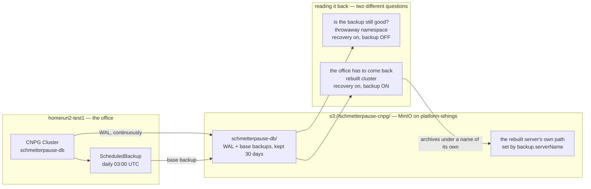

# Backing up and moving the game data

The rules are in [ADR-0016](adr/0016-azure-auf-zeit-daten-ziehen-um.md): the
Azure instance only ever runs temporarily, and the game data moves between
Compose, Kubernetes and Azure as a logical dump, one writer at a time.
[ADR-0019](adr/0019-backup-auf-kubernetes.md) adds backups on Kubernetes
through the Barman Cloud plugin, and made the office's move there wait for a
timed restore.

This page is the how. Everything on it has been run — except
[Rebuilding a lost cluster](#rebuilding-a-lost-cluster), which is marked as
unrehearsed where it stands, because a runbook nobody has followed is a draft.
What has been run: a full round trip
Kubernetes → Azure → Kubernetes → Compose on 2026-09-12, with row counts
compared at every station and a PIN sign-in on Azure and on Compose; backups
switched on, a backup taken and restored into an empty namespace on
2026-09-13; and the office moved from Compose to Kubernetes the same day, and
its first backup was restored. The records are at the end.

## The two tasks

```sh
task db:dump    ENV=compose|kubernetes|azure
task db:restore ENV=compose|kubernetes|azure FILE=schmetterpause-….sql
```

The logic is `scripts/db.sh`; `scripts/db-counts.sql` is what gets counted.

**A dump** writes `schmetterpause-<env>-<time>.sql` — a plain `pg_dump` with
`--no-owner --no-acl`, schema, data and `goose_db_version` — and next to it
`….sql.counts`, the row counts of every table. It counts before and after the
dump and refuses if the two differ: somebody entered a result while it ran.

**A restore** refuses a database that already has players. Otherwise it resets
the schema — the application's own migration has usually created empty tables
already — and loads the dump as the role the application connects as, in one
transaction, so a failure leaves the database as it was. Then it compares the
counts with the dump's `.counts`, sorted.

**Both files are sensitive.** They hold display names, PIN hashes and
recovery-code hashes. `schmetterpause-*.sql` and `schmetterpause-*.sql.counts`
in the repository root are gitignored and written with mode `600`. Never let
one become a CI artefact, and keep the one from a teardown somewhere a person
chooses — once the server is gone, it is the only copy.

## First: back up the office

**Since 2026-09-13 the office plays on Kubernetes**: the CloudNativePG cluster
`schmetterpause-db` in namespace `schmetterpause` on homerun2-test1, served at
<https://schmetterpause.homerun2-test1.sthings-vsphere.labul.sva.de>. It
archives its WAL and takes a base backup every night (see
[Scheduled backups on Kubernetes](#scheduled-backups-on-kubernetes)).

The local Compose project `schmetterpause` is stopped. Its volume
`schmetterpause_pgdata` still holds the office as it was at 14:25Z that day,
and it stays as the fallback. **Do not start it with `task office:up` while the
cluster is in use**: that is a second ranking, and nothing merges the two back
together. The only way between them is a dump, and a dump replaces everything
on the other side. `task down` still deletes that volume.

Before any work that moves or could touch game data, dump it and prove the dump
restores — a backup nobody restored is not a backup. The nightly backup does
not replace this: it is recovery in place, a dump is what you can hold.

```sh
KUBECONFIG=~/.kube/homerun2-test1 task db:dump ENV=kubernetes   # reads only; the app keeps running

# Probe-restore into a throwaway Compose project with its own volume and no ports.
cat > /tmp/compose.probe.yaml <<'EOF'
services:
  db:
    ports: !reset []
  app:
    ports: !reset []
EOF
COMPOSE_PROJECT_NAME=sp-probe COMPOSE_FILE=compose.yaml:/tmp/compose.probe.yaml \
  docker compose up --detach --wait db
COMPOSE_PROJECT_NAME=sp-probe COMPOSE_FILE=compose.yaml:/tmp/compose.probe.yaml \
  task db:restore ENV=compose FILE=schmetterpause-kubernetes-….sql     # "counts match"
COMPOSE_PROJECT_NAME=sp-probe COMPOSE_FILE=compose.yaml:/tmp/compose.probe.yaml \
  docker compose down --volumes
```

`down --volumes` only ever with the probe project named. Without the variables
it is the office's fallback volume.

`task office:backup` writes a plain dump of the Compose database only; it does
not reach the cluster.

## Compose

Whatever `docker compose` would address from the repository root: the project
named after the directory, or `COMPOSE_PROJECT_NAME` and `COMPOSE_FILE` when set.
The database container has to be running.

A restore stops the app first — it migrates on start and serves requests,
neither of which belongs in the middle of a restore — and starts it again
afterwards, also when the load fails.

## Kubernetes

Whatever kubeconfig and context `kubectl` uses. The task names them before it
does anything; check that line.

```sh
KUBECONFIG=~/.kube/homerun2-test1 task db:dump ENV=kubernetes
KUBECONFIG=~/.kube/homerun2-test1 task db:restore ENV=kubernetes NAMESPACE=… FILE=…
```

`NAMESPACE` defaults to `schmetterpause`, `DB_CLUSTER` to `schmetterpause-db`.
`pg_dump` and `psql` run inside the CloudNativePG primary over its local socket,
so no credential leaves the cluster. The load runs behind `SET ROLE <owner>`:
as `postgres`, every table would belong to `postgres` and the application could
not touch them.

A restore refuses while the application's Deployment has replicas. Scaling it is
a decision about that environment, so the task leaves it to you:

```sh
kubectl -n <namespace> scale deployment/schmetterpause --replicas=0
# restore
kubectl -n <namespace> scale deployment/schmetterpause --replicas=1
```

**Under ArgoCD a plain scale does not hold.** On homerun2-test1 the Application
`schmetterpause-test1` syncs with `selfHeal`, and `argocd-controller` owns
`spec.replicas` through server-side apply, so the Deployment is back at 1 within
seconds. Stop Argo reconciling that one Application first, and check that it
holds before anything else stops:

```sh
argo() { KUBECONFIG=~/.kube/platform-sthings kubectl -n argocd "$@"; }

argo annotate application schmetterpause-test1 argocd.argoproj.io/skip-reconcile=true
kubectl -n schmetterpause scale deployment/schmetterpause --replicas=0
sleep 60; kubectl -n schmetterpause get deployment schmetterpause   # still 0/0?
# restore
argo annotate application schmetterpause-test1 argocd.argoproj.io/skip-reconcile-
```

Removing the annotation is the scale back up: Argo syncs within a second and
restores the replica count from Git. Nothing in Git changes, and the parent
Application and Flux leave the annotation alone.

A restore also refuses a database that has players, and there is no task to
empty one — see [Not covered](#not-covered). When that is the decision, after a
verified dump of what is there, it is the same reset the restore does, as the
owner role:

```sh
printf '%s\n' 'SET ROLE "schmetterpause";' 'SET client_min_messages = warning;' \
  'DROP SCHEMA public CASCADE;' 'CREATE SCHEMA public;' |
  kubectl -n schmetterpause exec -i schmetterpause-db-1 -c postgres -- \
    psql -d schmetterpause -X -q -1 -v ON_ERROR_STOP=1
```

Only with the app at 0, and with the restore right after it.

A throwaway cluster to restore into, the way the round trip made one:

```sh
kubectl create namespace schmetterpause-restore-test
task kcl:secrets NAMESPACE=schmetterpause-restore-test
task kcl:database PROFILE=existing-secrets -- -D config.namespace=schmetterpause-restore-test \
  | kubectl apply -f -
```

It came up healthy in under a minute. Delete the namespace afterwards; the
volume goes with it.

## Scheduled backups on Kubernetes

Switched on for homerun2-test1 on 2026-09-13
(stuttgart-things/stuttgart-things#2957), from `database.backup` in
`apps/schmetterpause/database` in `stuttgart-things/argocd`:

- **WAL archiving**, continuously, and a **base backup every night at 03:00
  UTC**, kept for 30 days
- into `s3://schmetterpause-cnpg/` on the platform MinIO
  (`artifacts.platform.sthings-vsphere.labul.sva.de`), as a MinIO user of the
  same name whose policy covers only that bucket
- with the key pair from its own Vault entry, `schmetterpause-backup` under the
  `schmetterpause` mount (stuttgart-things/stuttgart-things#2956) — not the
  app's entry, whose whole-entry write could reset the session key
- the endpoint's certificate checked against `cluster-trust-bundle`, never
  skipped
- through `plugin-barman-cloud` in the operator's namespace `postgres`

Everything above stays the way to *move* data. The plugin is recovery in place.



Three things worth reading off it:

- **One path is written by exactly one server.** `schmetterpause-db/` belongs to
  the office's Cluster and nothing else may archive into it. The plugin enforces
  that — it refuses a non-empty archive rather than mixing two timelines
  (measured 2026-09-16, below) — but the failure is quiet: a second server would
  come up healthy and never back itself up.
- **The two ways of reading it back are different questions, not two steps.**
  "Is this backup still good" writes nowhere at all; "the office has to come
  back" writes, and therefore needs a name of its own.
- **What the picture cannot show is how few copies there are.** That bucket
  lives on one MinIO with one replica and a 10Gi `openebs-hostpath` volume, and
  Velero's own target is the same MinIO
  ([stuttgart-things#2968](https://github.com/stuttgart-things/stuttgart-things/issues/2968)).
  Everything above the line is careful; the line itself rests on one disk.


**A green sync proves nothing, and neither does the condition.** The Cluster
reported `ContinuousArchiving=True` before the plugin was even installed. What
proves archiving is `pg_stat_archiver`, and what proves a backup is its phase:

```sh
kubectl -n schmetterpause exec schmetterpause-db-1 -c postgres -- psql -tAc \
  "select archived_count, failed_count, last_archived_wal, last_archived_time from pg_stat_archiver"
kubectl -n schmetterpause get backup     # phase completed
```

A backup by hand, before anything risky:

```sh
kubectl apply -f - <<EOF
apiVersion: postgresql.cnpg.io/v1
kind: Backup
metadata:
  name: schmetterpause-db-manual-$(date -u +%Y%m%d%H%M)
  namespace: schmetterpause
spec:
  cluster:
    name: schmetterpause-db
  method: plugin
  pluginConfiguration:
    name: barman-cloud.cloudnative-pg.io
EOF
```

**Restoring it** goes into a new Cluster in an empty namespace, never over the
running one. The namespace needs three things: a copy of the chart's
`ExternalSecret` `schmetterpause-db-backup` (key pair plus trust bundle), an
`ObjectStore` pointing at the bucket, and the Cluster.

```yaml
apiVersion: barmancloud.cnpg.io/v1
kind: ObjectStore
metadata:
  name: restore-origin
  namespace: schmetterpause-restore-probe
spec:
  # No retentionPolicy: this store only reads.
  configuration:
    destinationPath: s3://schmetterpause-cnpg/
    endpointURL: https://artifacts.platform.sthings-vsphere.labul.sva.de
    endpointCA: { name: restore-origin-backup, key: trust-bundle.pem }
    s3Credentials:
      accessKeyId: { name: restore-origin-backup, key: ACCESS_KEY_ID }
      secretAccessKey: { name: restore-origin-backup, key: ACCESS_SECRET_KEY }
    wal: { compression: gzip }
    data: { compression: gzip }
---
apiVersion: postgresql.cnpg.io/v1
kind: Cluster
metadata:
  name: restore-probe
  namespace: schmetterpause-restore-probe
spec:
  instances: 1
  imageName: ghcr.io/cloudnative-pg/postgresql:18
  storage: { size: 2Gi, storageClass: openebs-hostpath }
  bootstrap:
    recovery:
      source: origin
  externalClusters:
    - name: origin
      plugin:
        name: barman-cloud.cloudnative-pg.io
        parameters:
          barmanObjectName: restore-origin
          serverName: schmetterpause-db
```

Two things about that Cluster matter more than they look. It has **no
`spec.plugins`**: a restored cluster that archived would write into the
origin's archive. And it names the **StorageClass**: homerun2-test1 has two
default ones, so without it nobody knows which a PVC gets.

It replays to the end of the archive and promotes itself. Compare the counts
with the origin, then delete the namespace; `openebs-hostpath` removes the
volume with it.

To prove one particular backup rather than "whatever the archive ends with",
stop at it — `recoveryTarget: {backupID: <id>, targetImmediate: true}` under
`bootstrap.recovery` — and compare with a dump taken just before it. A running
origin keeps changing, so its counts only match by luck.

## Rebuilding a lost cluster

Everything above restores data *into* a cluster that exists. This is the other
case: `homerun2-test1` is gone and the office's ranking has to come back onto a
new one.

> **Not rehearsed.** The pieces are proven separately — the recovery bootstrap
> (below, and the records at the end), the Vault and Argo paths (audited object
> by object in
> [#248](https://github.com/stuttgart-things/schmetterpause/issues/248)) — but
> nobody has run this list top to bottom against a cluster that did not exist
> before. The rehearsal is
> [#259](https://github.com/stuttgart-things/schmetterpause/issues/259)'s
> Definition of Done point 1 and needs a throwaway cluster
> (stuttgart-things/stuttgart-things#2989). Expect to find steps that are not
> written here; when you do, write them down.

**Almost everything comes back from Git by itself.** The cluster registration,
cert-manager, trust-manager and `cluster-trust-bundle`, External Secrets,
openebs and its StorageClass, the Cilium gateway, the CNPG operator and
`plugin-barman-cloud` — all Argo-managed, nothing on the cluster unmanaged.
The part that does not come back by itself is the data, and the step that
brings it back is step 5.

### The order

**1. Stop anyone entering results.** A half-rebuilt instance that accepts a
match is a second ranking. No QR sheet, no link in Teams, until step 6 passes.

**2. New cluster, kubeconfig into Vault.** The `ClusterbookCluster` picks it up
and Argo registers it.

**3. Vault Kubernetes auth, re-applied against the new API server.** A manual
step, and the one already known:
`argocd/clusters/homerun2-test1/vault-k8s-auth` in `stuttgart-things`, locally
or through the dispatch workflow's `create-vault-k8s-auth`. A new cluster has a
new API address and reviewer token; without this ESO reads nothing — no
database credentials, no backup keys.

```sh
kubectl get externalsecret -A     # every one must reach SecretSynced
```

A `Valid` `ClusterSecretStore` proves only that the login works, not that
anything can be read. Check the ExternalSecrets.

**4. Base apps sync by themselves.** Wait for them rather than helping.

**5. Schmetterpause with recovery on — not a plain sync.** A plain sync runs
`initdb` and the office comes back with an empty ranking, healthy, `/readyz`
answering 200, and the first person who joins starts a second one. Nothing
alerts on an empty ranking.

In
`clusters/labul/vsphere/platform-sthings/argocd/homerun2-test1/schmetterpause.yaml`,
**before the first sync**:

```yaml
        database:
          backup:
            enabled: true
            serverName: schmetterpause-db-r1     # where the REBUILT server archives
            # endpointURL, destinationPath, remoteKey unchanged
          recovery:
            enabled: true
            sourceServerName: schmetterpause-db  # where it reads from
```

The two names must differ. Unset, the plugin archives under the *Cluster* name,
which is the path being recovered from; the chart refuses to render that
(stuttgart-things/argocd#453). Pick the new name deliberately — it is what the
*next* rebuild will have to name as its source.

`spec.bootstrap` is read only when the Cluster is created. Getting this wrong
is not a value you can correct afterwards: it means deleting the Cluster and
its volume and doing step 5 again.

**6. Check it is the office, before anyone uses it.**

```sh
kubectl -n schmetterpause exec schmetterpause-db-1 -c postgres -- psql -U postgres -d schmetterpause -tAc \
  "select 'players='||(select count(*) from players)||' matches='||(select count(*) from matches)"
curl -fsS https://schmetterpause.homerun2-test1.sthings-vsphere.labul.sva.de/readyz
```

Counts against the last dump or the backup it recovered from, then a PIN
sign-in. A sign-in is the check; entering a result is not.

**7. Prove it can back itself up**, which is the step that catches a rebuild
that looks finished:

```sh
kubectl -n schmetterpause get cluster schmetterpause-db \
  -o jsonpath='{.spec.plugins[0].parameters.serverName}{"\n"}'   # the NEW name
kubectl -n schmetterpause exec schmetterpause-db-1 -c postgres -- psql -tAc \
  "select archived_count, failed_count, last_archived_wal from pg_stat_archiver"
```

then a manual `Backup` (the YAML is under [Scheduled backups on
Kubernetes](#scheduled-backups-on-kubernetes)) and wait for phase `completed`.

### If archiving never starts

`ContinuousArchiving=False` with `archived_count` stuck at 0 means the archive
path is not empty — almost certainly `serverName` collides with the source.
The log says so:

```
barman-cloud-check-wal-archive: WAL archive check failed for server <name>: Expected empty archive
```

**Nothing is corrupted by this**, and the office's archive is intact: the
plugin refuses before the first segment rather than mixing two timelines.
What you have instead is a database that reports `Cluster in healthy state`,
serves the office, and never backs itself up, while WAL it cannot recycle grows
on its volume. `SchmetterpauseWALArchivingFailing` reports it after 15 minutes.

**The Cluster does not have to be recreated.** The check runs on every archive
attempt, not once at startup, so correcting `serverName` — or emptying the
path — is enough; archiving starts on the next retry.

### Two things that are easy to get wrong afterwards

- **Do not set `backup.serverName` on a running Cluster** to tidy up. It starts
  a new path, and the backups taken before it stay where the next recovery will
  not look.
- **`recovery` may stay on.** It is inert once the Cluster exists. But the next
  rebuild's `sourceServerName` is then the *current* `backup.serverName`, not
  `schmetterpause-db`.

### What this step list does not know yet

- **How long it takes.** Step 5 alone is under a minute (records below); steps
  2 to 4 have never been timed on a cluster that did not exist.
- **Which manual steps exist besides step 3.** That is most of what the
  rehearsal is for.
- **What admission does.** The rebuilt pod passes the image-signature policy on
  its way in. Today that policy runs `Audit` with `failurePolicy: Ignore`, so it
  cannot block a rebuild. Under `Deny` it could, and whether it also depends on
  Kyverno being up is what
  [#262](https://github.com/stuttgart-things/schmetterpause/issues/262) decides
  — that decision belongs to this runbook as much as to the policy.

## Azure

Needs an applied instance (`task tf:apply`) and a live login (`task tf:login`).
The task reads the server, the major version and the credentials from the
Terraform state and the two `.tfvars` files.

```sh
task db:dump    ENV=azure                       # before task tf:destroy
task db:restore ENV=azure FILE=schmetterpause-….sql   # after task tf:apply
```

It does not connect from your machine. Both directions run in a one-off Azure
Container Instance, for three reasons found the hard way:

- **The office network blocks outbound port 5432.** A firewall rule on the
  server for your address does nothing against that.
  `curl -s --max-time 10 http://portquiz.net:5432/ >/dev/null && echo open || echo blocked`
  shows it.
- **Docker Hub refuses anonymous pulls from Azure** (`RegistryErrorResponse`).
  The container runs `ghcr.io/cloudnative-pg/postgresql:<major>` instead — the
  image the kcl module runs the database with, at the server's major.
- **It gets its own resource group,** `<name_prefix>-dbjob-rg`. `azurerm` refuses
  to delete a resource group that holds resources it does not manage
  (`prevent_deletion_if_contains_resources` defaults to `true`), so anything
  left in `schmetterpause-rg` would break `tf:destroy`. The job group is deleted
  whenever the task ends, successful or not. If a run is killed hard and the
  group survives, the next run says so and stops.

The container reaches the server through the existing "allow Azure services"
rule. A dump comes back through `az container logs`, gzipped and base64-encoded
between markers with a sha256 that the task checks. A restore goes in through an
Azure Files share in the job group, uploaded over HTTPS. The password and the
storage key only ever sit in a mode-`600` file in a private temporary directory,
deleted as soon as the container exists.

After a restore the task restarts the application's revision, so its init
container runs `migrate up` against the restored schema — which matters as soon
as the image is newer than the dump.

On 2026-09-12 a dump took 156 seconds and a restore 119, most of it pulling the
image and creating the storage account.

## Versions

A dump only ever goes into the **same or a newer** PostgreSQL major, and the
same or a newer application version. Everything is on 18: Compose, the kcl
default (#221), Azure (#224), and the CloudNativePG cluster on homerun2-test1
since its in-place upgrade on 2026-09-12 (see below).

That cluster's major is pinned in `stuttgart-things/stuttgart-things`, as
`database.imageName` in
`clusters/labul/vsphere/platform-sthings/argocd/homerun2-test1/schmetterpause.yaml`.
The catalog default in `stuttgart-things/argocd`
`apps/schmetterpause/install/values.yaml` is 18 as well
(stuttgart-things/argocd#398), and the PR previews, which set no image, get it.
The homerun2-test1 pin stays anyway, so a later catalog change cannot move the
office's Cluster to another major.

## What travels, and what does not

- **Players sign in once.** A new environment is a new host, so no browser is
  recognised. PINs and recovery codes come along in the dump, and signing in
  with them works — checked on Azure and on Compose, and on Kubernetes after the
  office move. `SP_SESSION_KEY` only matters behind an address that stays the
  same.
- **Pending and disputed matches travel as they are.** Somebody still has to
  confirm them on the other side.
- **Kiosk grants travel, the kiosk does not.** The office's Compose stack had
  one; on homerun2-test1 it is off (ADR-0014), so the grants sit in the table
  with no route that reads them.
- **Flexible Server's own backups do not.** They are deleted with the server.
- **Row order can differ.** The Alpine images sort text bytewise even though
  they report `en_US.utf8` — musl has no collation — while Flexible Server
  sorts by locale. That is why the counts are compared sorted, and it is worth
  knowing when a restored instance lists names in a different order.

## The round trip on 2026-09-12

The data was the tournament from 2026-09-11 — the Kubernetes trial cluster has
no PINs, so it could not show a sign-in. Every arrow is one `task db:dump` or
`task db:restore`.

| Station | PostgreSQL | Result |
| --- | --- | --- |
| Tournament dump from the first Azure teardown | 17.11 | taken by hand that morning, 43,049 bytes |
| → Kubernetes, fresh test cluster | 18.6 | restored, counts match |
| Kubernetes → dump | 18.6 | 43,171 bytes, counts equal before and after |
| → Azure, fresh instance | 18 | restored in 119 s, revision restarted, healthy |
| Azure → dump | 18.6 | 43,146 bytes in 156 s, checksum ok |
| → Kubernetes, a second fresh test cluster | 18.6 | restored, counts match |
| Kubernetes → dump → Compose, app running | 18.6 | app stopped, restored, counts match, app started, healthy |
| PIN sign-in | | on Azure and on Compose, `player signed in` in both logs |

The sorted counts hash to the same value at every station: 7 players,
9 identities, 14 credentials, 34 matches (33 confirmed, 1 pending), 35 sets,
66 rating-history rows, 2 tournaments with 12 entries, migrations at
`20260904120000`.

Before it started, the office Compose database was dumped and probe-restored:
15 players, 66 matches, counts matching. The round trip never touched it.

## The Kubernetes trial cluster to 18, 2026-09-12

A different kind of move: no dump and restore, but CloudNativePG 1.30's offline
in-place major upgrade (`pg_upgrade --link`), triggered by changing the
Cluster's `imageName` from `:17` to `:18` (stuttgart-things/stuttgart-things#2899).
The prerequisites from the CNPG documentation held: both images on the same
Debian base, the source at 17.11 (at least 17.6 is required), no extensions.

The backup came first: `task db:dump ENV=kubernetes`, probe-restored into an
isolated Compose project with matching counts. Then:

| Time | What happened |
| --- | --- |
| 12:45 | Argo synced the new `imageName`; the Cluster went to `Upgrading Postgres major version` |
| 12:46 | the `major-upgrade` job ran `pg_upgrade` on the 18 image |
| 12:47 | the instance started on 18; `Cluster in healthy state` at 12:47:49 |

About two minutes offline. The server reports 18.6, a dump taken right after
has the same counts as the one taken before — 6 players, 12 matches, 20
rating-history rows, migrations at `20260904120000` — and the app's `/readyz`
answered 200.

Had it failed, the way back was the same line set to `:17`: CNPG restarts on
the old major, because the upgrade does not modify the old data.

## Backups on, and a timed restore, 2026-09-13

Still the trial data — 6 players, 12 matches — because ADR-0019 wanted the
restore proven before the office's data went anywhere near it. Times are UTC.

| Time | What happened |
| --- | --- |
| 13:57:53 | Argo applied `database.backup`: `spec.plugins` on the Cluster, the `ExternalSecret` synced, the `ObjectStore` created |
| 13:59:25 | the Postgres pod restarted with the plugin sidecar, about 90 s after the change; the app pod was not restarted |
| 13:59:49 | `pg_switch_wal()`, the segment archived within 10 s |
| 14:00:00 | manual Backup `20260913T140000`, `completed` after 7 s; 2 base and 5 WAL objects, 4.3 MB |
| 14:00:39 | restore into the empty namespace `schmetterpause-restore-probe` started |
| 14:01:40 | restored primary ready — **61 s** — with the same counts as the origin, promoted on timeline 2 |

`pg_stat_archiver` counted 27 failed attempts, all in the old pod between the
Cluster change and its restart, when archiving already pointed at a sidecar that
pod did not have. None since; that count is harmless on a switch-on and worth
recognising rather than chasing.

## The office move to Kubernetes, 2026-09-13

Compose → homerun2-test1, a Sunday afternoon, one writer throughout. Times are
UTC.

| Time | What happened | Result |
| --- | --- | --- |
| 14:24:42 | `skip-reconcile` on `schmetterpause-test1`, Kubernetes app scaled to 0 | still 0 after 60 s |
| 14:25:47 | office Compose app stopped, database left running | |
| 14:25:49 | final `task db:dump ENV=compose` | 70,007 bytes |
| 14:25:57 | that dump probe-restored into `sp-probe` | counts match, probe removed |
| 14:26:00 | Kubernetes trial data dumped, schema reset as the owner role | |
| ~14:26:02 | `task db:restore ENV=kubernetes` | counts match |
| 14:26:02 | annotation removed; Argo scaled the app up, its `migrate` init found nothing to run | `/readyz` 200 |
| 14:26:08 | counts again, with the app running | unchanged |
| 14:26:35 | manual Backup `20260913T142609` | `completed`: the office is in the bucket |
| 14:26:36 | office Compose stack stopped, volume kept | |
| 14:27:36 | first `player signed in` on Kubernetes | |

About 50 seconds without an office instance, from the Compose app stopping to
the Kubernetes app ready.

Counts on both sides: 16 players, 27 identities, 27 credentials, 66 matches
(65 confirmed, 1 pending), 113 sets, 130 rating-history rows, 1 tournament with
5 entries, 11 kiosk grants, migrations at `20260904120000`. The final Compose
dump and the trial data from Kubernetes are both in the repository root of the
machine that ran it.

## The office's own backup restored, 2026-09-13

The restore at 14:01 proved the mechanism on trial data. This one proves it on
the office: backup `20260913T142609`, taken right after the move, restored into
the empty namespace `schmetterpause-restore-office` at 15:13 UTC.

It did not replay to the end of the archive. The live database had moved on by
then — sign-ins, and whatever gets entered on a Sunday — so its counts were no
fixed reference. The Cluster stopped at the end of that one backup instead:

```yaml
bootstrap:
  recovery:
    source: origin
    recoveryTarget:
      backupID: 20260913T142609
      targetImmediate: true
```

and was compared with the counts of the move dump it was taken after,
`schmetterpause-compose-2026-09-13-1425.sql.counts`, sorted, table by table.

| | |
| --- | --- |
| Empty namespace → ready primary | 58 s |
| Counts against the move dump | identical: 16 players, 27 identities, 27 credentials, 66 matches (65 confirmed, 1 pending), 113 sets, 130 rating-history rows, 1 tournament with 5 entries, 11 kiosk grants, migrations at `20260904120000` |
| PIN hashes | 27, so signing in would work |
| Restored Cluster | promoted on timeline 2; no archiver, the origin's archive gained no failures |

The namespace was deleted afterwards.

## The recovery path from the chart, 2026-09-16

The 58 s restore above used hand-written YAML. This one used the chart
(stuttgart-things/argocd#453), which is what a rebuild will run, and answered a
question that had been open since the backups were switched on.

**Probe 1 — does the chart's recovery path produce the office?** Namespace
`schmetterpause-recovery-probe` on homerun2-test1, recovering from
`serverName: schmetterpause-db` and archiving under `probe-r1`.

| | |
| --- | --- |
| Created → `Cluster in healthy state` | 42 s |
| Counts against the live office | identical: 16 players, 69 matches (68 confirmed), 120 sets, 136 rating-history rows |
| Archived under | `probe-r1`, not the office's path |
| Manual `Backup` | `completed`, `20260916T053037` |
| Bucket afterwards | `probe-r1/` beside `schmetterpause-db/` |

It replayed to the end of the archive rather than stopping at a backup, and the
counts still matched — a quiet Wednesday morning, where the 2026-09-13 restore
had a Sunday moving underneath it.

**Probe 2 — what happens if a rebuild archives into the path it recovered
from?** A fresh `initdb` Cluster pointed at `probe-r1` after probe 1 was
deleted. It never wrote a segment:

```
barman-cloud-check-wal-archive: WAL archive check failed for server probe-r1: Expected empty archive
ContinuousArchiving=False   archived_count=0   failed_count=9
```

**So two servers in one path do not corrupt each other's timeline.** That claim
was carried by the flux component `schmetterpause-db-backup`, by
stuttgart-things/argocd#424 and by
[#259](https://github.com/stuttgart-things/schmetterpause/issues/259), and it is
wrong for `plugin-barman-cloud` v0.15.0. The plugin checks first and refuses.
The real failure is the quiet one in the runbook above.

`SchmetterpauseWALArchivingFailing` does catch it, after 15 minutes. That is
not obvious from its expression, which compares `last_failed_time` against
`last_archived_time` on a server that has never archived once: the exporter
reports `cnpg_pg_stat_archiver_last_archived_time = -1` there rather than
dropping the series, so the comparison holds. Read off the probe.

**Probe 3 — recovery without archiving.** `recovery` on, `backup` off: up in
56 s with the same counts, `spec.plugins` empty, no `ScheduledBackup`, and its
prefix in the bucket stayed empty. `archive_mode` reads `on` because CNPG always
sets it; with no archiver plugin nothing reaches object storage. That is the
shape for asking whether a backup is still good, as opposed to rebuilding onto
it — and it now comes from the chart instead of being written by hand.

All three namespaces and their paths in the bucket were deleted. The office was
not touched: `Cluster in healthy state`, `ContinuousArchiving=True`, same counts
before and after.

**One thing found while cleaning up**, which is why the runbook says a refused
Cluster need not be recreated: the empty-archive check runs on *every* archive
attempt, not once at startup. Probe 2 was still running when its path was
emptied, and it archived into it on the next retry — which also means a bucket
listing taken while a writer is alive proves nothing. Delete the Cluster first,
list afterwards.

## Not covered

- **The rebuild, end to end.** [Rebuilding a lost
  cluster](#rebuilding-a-lost-cluster) is written from proven pieces and an
  audit, not from having done it. Until it has been rehearsed on a throwaway
  cluster, treat its timings as unknown and expect manual steps it does not
  name.
- **Point-in-time recovery to a moment.** Both restores either replayed to the
  end of the archive or stopped at the end of a named backup. Recovering to a
  time just before a mistake needs `recoveryTarget.targetTime` and WAL from
  after the base backup; that has not been tried.
- **Emptying a database that has players.** There is no task for it, on
  purpose: a restore replaces everything, and the moment somebody wants that for
  the office is a decision to make by hand, after a verified backup. The
  commands are under [Kubernetes](#kubernetes); the office move is the one time
  they were used.
