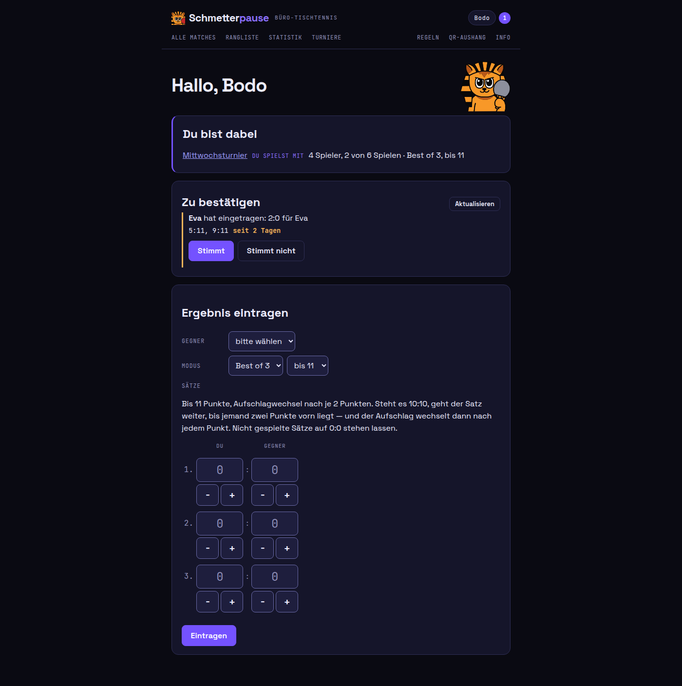
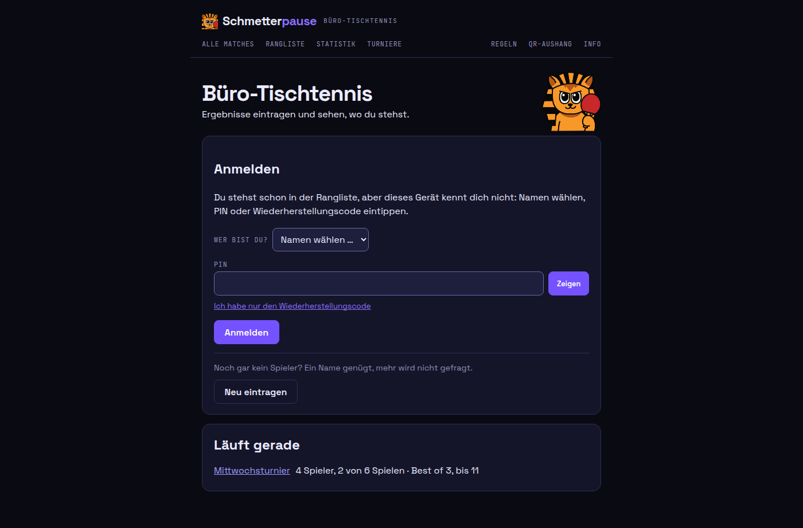
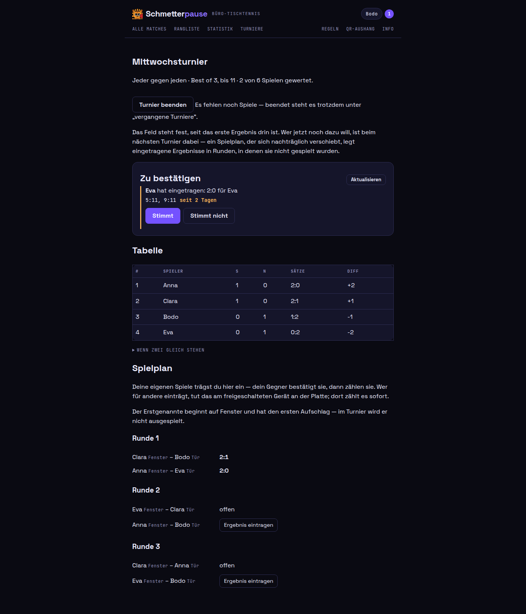
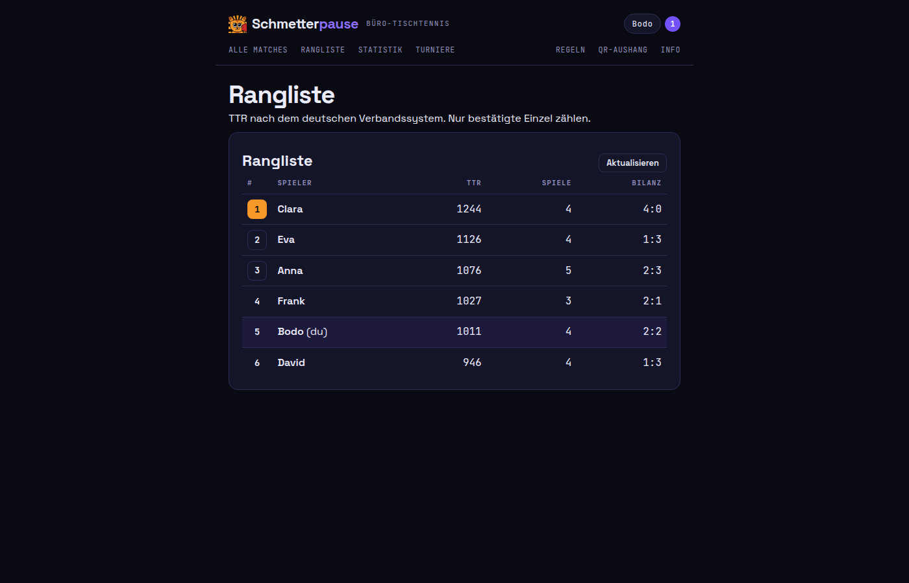
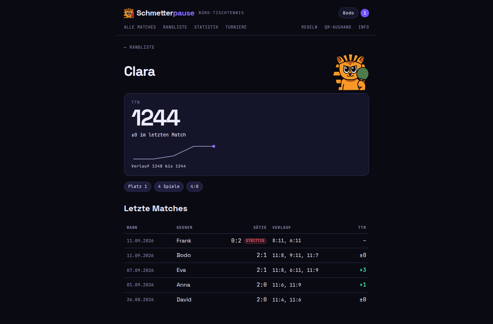
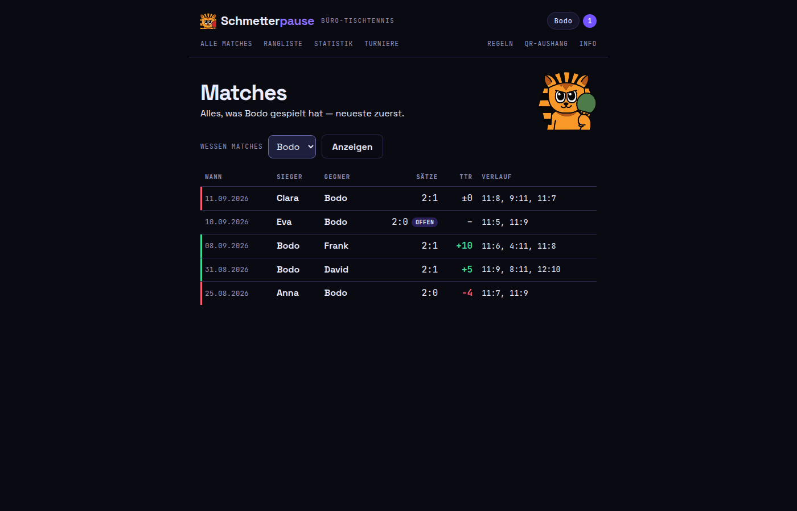
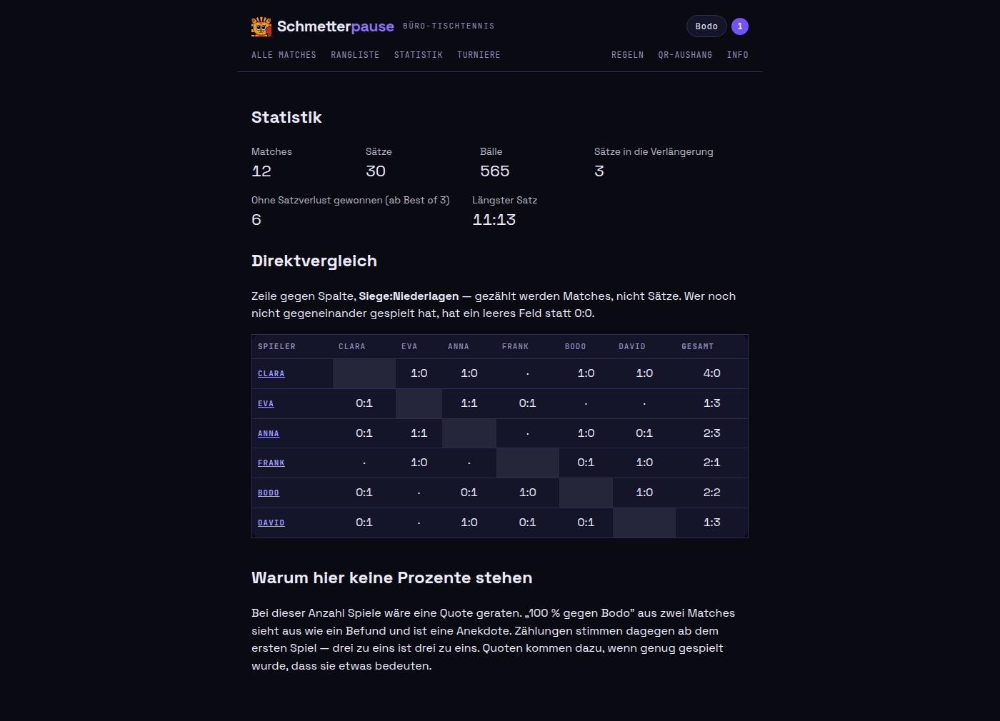
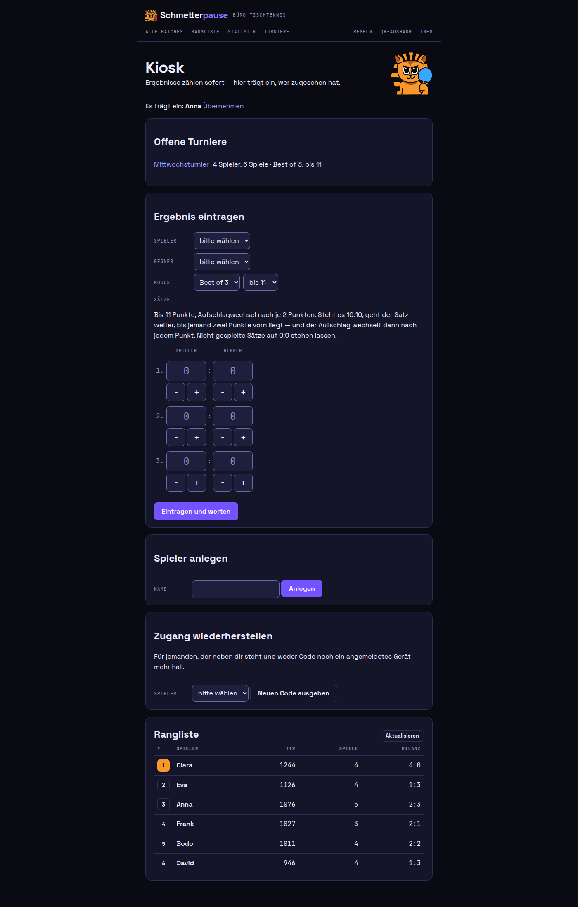
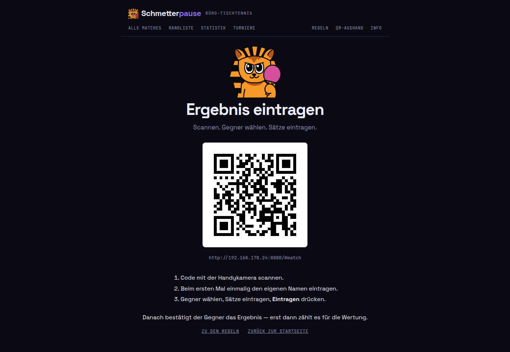
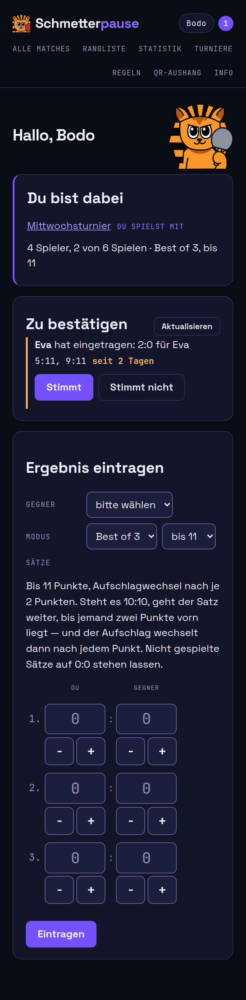

# Bildschirme

Was die App zeigt, Seite für Seite. Alle Bilder stammen aus demselben
Demo-Datenbestand — sechs Spieler, zwölf Ergebnisse, ein laufendes Turnier —,
den `schmetterpause seed` anlegt. Wer die App lokal startet, sieht genau das;
unten steht, wie.

## Startseite



Drei Dinge untereinander, in der Reihenfolge, in der sie jemanden angehen:

1. **Was gerade läuft.** Ein Turnier, in das dich jemand aufgenommen hat,
   steht hier — sonst würdest du davon erst erfahren, wenn du von dir aus unter
   *Turniere* nachsiehst.
2. **Was auf dich wartet.** Wer ein Ergebnis gegen dich eingetragen hat, und
   die beiden Knöpfe, mit denen du es bestätigst oder bestreitest. Die Zahl
   oben rechts sagt dasselbe, wenn die Seite schon offen liegt.
3. **Ergebnis eintragen.** Gegner wählen, Sätze tippen, fertig. Gezählt wird
   es, sobald der Gegner es bestätigt.

## Anmelden



Wer schon in der Rangliste steht, wählt seinen Namen und tippt PIN oder
Wiederherstellungscode. Wer noch gar nicht dabei ist, geht darunter weiter:
ein Name genügt, kein Passwort, keine E-Mail. Was gerade läuft, steht auch
hier — dafür muss niemand angemeldet sein.

## Turnier



Tabelle und Spielplan auf einer Seite. Der Spielplan nennt für jede Paarung,
wer auf welcher Tischseite anfängt (hier *Fenster* und *Tür*) und hat für die
eigenen Spiele einen Knopf zum Eintragen. Gespielte Paarungen zeigen das
Ergebnis, die übrigen stehen auf *offen*.

## Rangliste



TTR nach dem deutschen Verbandssystem, die eigene Zeile hervorgehoben. Nur
bestätigte Einzel zählen — ein Ergebnis, das niemand bestätigt hat, bewegt
hier nichts.

## Profil



Wo jemand steht, wie er dahin gekommen ist, und die Matches dahinter: Sätze,
Verlauf und was das Match für die TTR wert war. Ein strittiges Ergebnis ist als
solches markiert und zählt nicht.

## Alle Matches



Dieselben Ergebnisse als Liste, wahlweise für einen Spieler oder für alle.
Offene und strittige stehen mit drin — eine Liste, die sie weglässt,
beantwortet „wo ist mein Match" mit Schweigen.

## Statistik



Zählungen statt Quoten: Matches, Sätze, Bälle, und der Direktvergleich als
Matrix. Warum da keine Prozente stehen, steht auf der Seite selbst.

## Kiosk



Der Laptop an der Platte, für den Abend, an dem einer für alle einträgt. Er
nennt zuerst, wer gerade tippt; Ergebnisse von hier zählen sofort, weil jemand
danebenstand. Außerdem legt er Spieler an und gibt einen neuen
Wiederherstellungscode aus, wenn jemand nicht mehr an seinen Spieler kommt.
Die ganze Geschichte dazu steht unter [Turnier vor Ort](turnier-vor-ort.md).

## QR-Aushang



Die Seite, die an die Wand neben die Platte kommt: scannen, Namen eintragen,
Ergebnis tippen. Zum Drucken gemacht, deshalb ohne Knopf dafür — Menü →
Drucken reicht.

## Auf dem Handy



Gebaut wird für das Gerät, das beim Spielen dabei ist. Dieselbe Startseite auf
einem 390 Pixel breiten Display: dieselben drei Abschnitte, untereinander, mit
Feldern, die ein Daumen trifft.

## Wie die Bilder entstehen

Der Demo-Datenbestand ist Teil des Binaries und schreibt durch die Regeln der
Anwendung — Ergebnisse werden bestätigt, nicht eingefügt, und die Ratings
rechnet derselbe Code aus wie im Betrieb. Er ist deterministisch: zwei Läufe
desselben Stands ergeben dieselben Zahlen, und damit dieselben Bilder.

```sh
task up     # App und Datenbank starten
task seed   # die sechs Namen, zwölf Ergebnisse und das Turnier hineinschreiben
```

`seed` verweigert eine Datenbank, in der schon Spieler stehen — die des Büros
ist also sicher. Danach liegen unter <http://localhost:8080> die Seiten von
oben: die Startseite, `/tournaments`, `/standings`, `/statistics`, `/matches`,
und mit gesetztem `SP_KIOSK_TOKEN` auch `/kiosk`.
