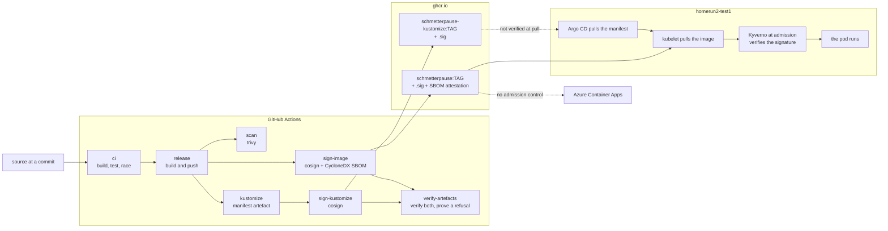

# Signatures, SBOM and what checks them

What runs should verifiably be what CI built, and something other than a human
should be the one checking. This page is the operator's side of that: what is
signed, how to check it by hand, what refuses an artefact that is not ours, and
what is deliberately not covered.

The decisions behind it are [ADR-0020](adr/0020-signieren-und-pruefen.md) and,
for how the pipeline does it, [ADR-0021](adr/0021-signieren-ueber-dagger-module.md).
The issues are [#230](https://github.com/stuttgart-things/schmetterpause/issues/230)
and [#254](https://github.com/stuttgart-things/schmetterpause/issues/254).

## At a glance

| | |
| --- | --- |
| Signature | keyless cosign — GitHub OIDC → Fulcio, recorded in Rekor |
| Signed by | `https://github.com/stuttgart-things/schmetterpause/.github/workflows/ci.yml@refs/*` |
| Issuer | `https://token.actions.githubusercontent.com` |
| Image | `ghcr.io/stuttgart-things/schmetterpause` — signature and CycloneDX SBOM attestation, both on the digest |
| Manifest artefact | `ghcr.io/stuttgart-things/schmetterpause-kustomize` — signature only |
| Tools | the `cosign`, `trivy`, `crane` and `kyverno` modules from [stuttgart-things/dagger](https://github.com/stuttgart-things/dagger), pinned in `Taskfile.yml` |
| Checked by | a Kyverno `ImageValidatingPolicy` at admission, the `verify-artefacts` job in CI, and the `policy-test` job for the policy itself |
| Not checked | Azure Container Apps, and every image that is not ours |
| First signed | the snapshot `3c7f3c7` on `main`, then the release `v0.9.0`; releases up to `v0.8.0` were published before anything was signed |

There is no key. Nothing to rotate, nothing in Vault, nothing to leak — and a
public record in the transparency log of every signature ever made, which for a
public package is the trade the project wanted. ADR-0020 has the reasoning.

## The chain, end to end

What CI builds, what signs it, and what checks it before it runs. Dashed edges
are the places nothing checks — they are drawn rather than left out, because a
picture that shows only the covered half is the failure this whole page exists
to avoid.



Three things the picture is meant to make obvious:

- **Only one arrow into the pod is checked.** The image passes Kyverno; the
  manifest artefact Argo pulls does not, because the kubelet never pulls it and
  admission cannot see it. `verify-artefacts` covers it in CI instead, which is
  weaker by construction: it checks what we published, not what the cluster
  pulled.
- **Azure hangs off the registry with nothing in between.** That is #206, and
  the environment is temporary (ADR-0016).
- **Sigstore is on the signing path, not the verifying one.** Admission reads
  the signature from the registry and verifies the timestamp against a root
  embedded in Kyverno — measured on 2026-09-16, a signed image verified with the
  policy's `ctlog.url` pointing at a host that does not resolve (#262). So a
  Sigstore outage stops a *build*, never a deploy.

## Checking an artefact by hand

```sh
task verify:signature                    # the current VERSION, both artefacts
task verify:signature TAG=v0.9.0         # a particular release
```

That needs Dagger and nothing else: it calls the cosign module the pipeline
calls, at the version `Taskfile.yml` pins. A release up to `v0.8.0` fails it,
correctly — nothing was signed before `3c7f3c7`.

The long form, so that the two strings above are readable rather than buried in
a Taskfile:

```sh
dagger call -m github.com/stuttgart-things/dagger/cosign@v0.131.0 verify \
  --ref=ghcr.io/stuttgart-things/schmetterpause:v0.9.0 \
  --certificate-oidc-issuer=https://token.actions.githubusercontent.com \
  --certificate-identity-regexp='^https://github\.com/stuttgart-things/schmetterpause/\.github/workflows/ci\.yml@refs/'
```

With cosign installed, `cosign verify` takes the same two values as
`--certificate-oidc-issuer` and `--certificate-identity-regexp`.

Both are needed and neither is enough on its own. Anybody can get a certificate
from that issuer; the identity says which workflow file, in which repository,
asked for it. The module refuses to verify without an identity, and so does
cosign, for exactly this reason.

### The inventory

```sh
task verify:sbom                         # build/sbom.cdx.json
task verify:sbom TAG=v0.9.0 DEST=/tmp/sbom.json
```

Which is this, and it goes through `verify-attestation` rather than a plain
download on purpose: an inventory that cannot be traced back to the pipeline is
a list, not evidence. The module unwraps the attestation and returns the
predicate itself.

```sh
dagger call -m github.com/stuttgart-things/dagger/cosign@v0.131.0 verify-attestation \
  --ref=ghcr.io/stuttgart-things/schmetterpause:v0.9.0 \
  --predicate-type=cyclonedx \
  --certificate-oidc-issuer=https://token.actions.githubusercontent.com \
  --certificate-identity-regexp='^https://github\.com/stuttgart-things/schmetterpause/\.github/workflows/ci\.yml@refs/' \
  export --path=sbom.cdx.json
```

It is a CycloneDX document written by the trivy module's `Sbom`, against the
same digest the scan job reads and with the same trivy image, so the scan and
the inventory of one release come from one scanner.

**It describes `linux/amd64`.** The release is one manifest covering two
architectures, and an SBOM is per image, not per index. The arm64 image is
built from the same source on the same base; run by hand on 2026-09-15, the
module's arm64 inventory listed the same 32 packages. A second attestation for
arm64 is still an open point in ADR-0020.

## What checks it without being asked

### On the cluster: Kyverno

`policy/verify-image-signature.yaml` is an `ImageValidatingPolicy`
(`policies.kyverno.io/v1`), scoped to `schmetterpause` and
`schmetterpause-pr-*`. It refuses — or, for now, reports — a pod whose
application image carries no signature from the identity above, whether the
pod names that image by tag or by digest, in a container or in an init
container. It names the signer with the same regexp as the verification above.

**On `homerun2-test1` the argocd catalog reconciles it.** The consumer sets
`policy.enabled` in `apps/schmetterpause/install`, whose child Application reads
this file from this repository at the same tag as the deployed release. The
policy on the cluster is therefore the one that release was tested against, and
a version bump moves app and policy together (stuttgart-things/argocd#446,
stuttgart-things/stuttgart-things#2982, live since 2026-09-15). For a cluster
outside that path:

```sh
task policy:apply
task policy:status
```

**A refusal reaches a human.** Under `Audit` a refusal is only a `PolicyReport`,
so the same consumer's monitoring scrapes Kyverno for this policy's results.
When a verification fails, it raises `SchmetterpauseUnsignedImageAdmitted`, which
goes through the cluster's Alertmanager to the Teams alert channel, followed by a
"Resolved:" card (stuttgart-things/argocd#448, #449). A server-side dry-run
counts as a refusal too; no Kyverno label tells the two apart.

**It is in `Audit` today.** It moves to `Deny` once it has seen three clean
releases, the posture Trivy took in this repository for the same reason: a rule
that has never run over a real release is a measurement, not a verdict.

| Release | Policy report | Date |
| --- | --- | --- |
| _(none yet — applied 2026-09-15 while `v0.9.0` was running; that pod predates the policy, so the first report comes with the next rollout)_ | | |

Fill that in as the releases come. When the third line is clean, change three
lines in the policy and say so here:

- `validationActions: [Audit]` becomes `[Deny]`;
- `mutateDigest` and `verifyDigest` become `true`, so that the pod carries the
  digest that was verified rather than the tag that resolved to it, and the
  kubelet cannot pull something else afterwards.

Kyverno 1.19.1 accepts that combination in a server-side dry run; what
admission does with it has not been watched yet, and the drill below is where
it is. A gate that cannot fail is a measurement, and the day it stops being one
is worth a line.

Three things to know before flipping it:

- `failurePolicy: Ignore`. If Kyverno cannot reach the registry or Rekor, the
  pod is admitted rather than refused. That is the right default for a cluster
  the office plays on and the wrong one for a claim of coverage, so it is
  named here rather than left to be discovered. Changing it to `Fail` makes
  every pod in those namespaces depend on Rekor being up.
- The policy covers the application image only. Postgres, and anything else in
  the same namespace, is not checked by it and is not claimed to be — and
  nothing stops a pod there from running a different image altogether.
- Until the flip, the tag is not rewritten to a digest. The signature is
  checked on whatever the tag resolved to at admission, and the kubelet may
  pull something else later. Under `Audit` that window is open.

### The policy itself: the `policy-test` job

`policy/tests/kyverno-test.yaml` lists the pods the policy must refuse — an
unsigned image by tag, by digest, by tag and digest, in an init container and
in a preview namespace — and the pods it must admit: a signed image by tag and
by digest, and a pod running only Postgres. The `policy-test` job runs
`kyverno test` over it on every change, through the kyverno module, with the
Kyverno release `homerun2-test1` runs (`KYVERNO_VERSION` in the Taskfile) and
with warnings as errors, so a deprecated policy kind fails before the cluster
stops accepting it.

```sh
task policy:test
```

It needs the network, because the policy checks signatures while it is tested,
and it depends on two published releases staying published: `v0.8.0`
(unsigned) and `v0.9.0` (the first signed one). `policy/tests/pods.yaml` says
why each.

What it cannot show is that a pod outside the two namespaces is left alone:
Kyverno produces no result for a resource it does not match, and `kyverno test`
counts a missing result as a failure.

### In the delivery path: the `verify-artefacts` job

The kustomize artefact is what Argo consumes, and admission never sees it — the
kubelet does not pull it. So for that half, the check is a CI job:
`verify-artefacts` in `.github/workflows/ci.yml` verifies both artefacts after
they are signed, through the cosign module, prints the certificate subject it
found, and fails the build if either does not verify.

It is weaker than admission by construction: it checks the thing we published,
not the thing the cluster pulled. Closing that would mean a policy engine in
front of Argo's OCI pull, which nothing in this org runs today — an open point
in ADR-0020.

## Proving it can refuse

> A verification that has never refused anything is indistinguishable from one
> that cannot.

Two halves, because one of them needs a cluster and one does not.

**Every build.** The last step of `verify-artefacts` runs the cosign module's
`verify-refuses` against an identity that must not match, for the signature and
for the SBOM attestation. It succeeds only when cosign refuses *because the
identity does not match*: a missing signature or an unreachable registry fails
it as well, so it cannot pass by failing for the wrong reason. It catches the
failure mode the drill below is for — an identity pattern that quietly matches
everything would sail through the step above it and keep doing so forever.

And the four places that name the signer — this page, the pipeline, the
Taskfile and the policy — are compared against each other by
`scripts/signing_test.sh`, which runs in the pipeline's lint stage
(`task signing:check` locally). Widening one of them is the quiet way this
stops being a gate. The test also fails if the policy names more than one
signer: its identities are alternatives, so a second entry beside the right one
widens the gate without making any single line look wrong.

**By hand, against the cluster: the drill, as recorded.** DoD point 5 asks for
a refusal that something other than a human catches, and that reaches a human.
It was run on `homerun2-test1` on 2026-09-15, under `Audit`. It used the
released, unsigned `v0.8.0` rather than a scratch tag, so nothing had to be
pushed to the release repository or deleted from it afterwards.

| Time (Z) | What happened | After creation |
| --- | --- | --- |
| 14:36:29 | `kubectl apply` of the pod `signature-drill`: image `…/schmetterpause:v0.8.0`, no app label, a command that does not exist. Admitted, as `Audit` must | 0 s |
| 14:36:33 | Kyverno: `image verification failed … failed to verify cosign signatures: no signatures found` | 4 s |
| 14:37:12 | `kyverno_image_validating_policy_results_total{result="fail"}` went from 1 to 2 in Prometheus. `PolicyReport` for the pod: `fail`, severity `high`, *the application image is not signed by the schmetterpause CI workflow* | 43 s |
| 14:37:21 | Alertmanager: `SchmetterpauseUnsignedImageAdmitted` active, `resource_namespace=schmetterpause` | 52 s |
| 14:37:51 | The notification-catcher caught it for Teams, and a person confirmed the card in the Teams alert channel | 82 s |
| 14:52:51 | Alertmanager had resolved the alert at 14:51:47, and the catcher caught the green "Resolved:" card. The rule held its full 15-minute window; before stuttgart-things/argocd#449 it resolved one minute after firing | 16 min 22 s |

The pod was deleted at 14:38:25. Its `PolicyReport` went with it, and the
office pod was not touched.

**What the drill does not show is what `Deny` does.** Under `Deny` the
`kubectl apply` itself should fail and name the policy, and `mutateDigest`
should rewrite the application pod's tag to its digest. Neither has been
watched yet. When the policy moves to `Deny`, run the drill again the same way
and add a second table:

```sh
kubectl apply -f - <<'EOF'
apiVersion: v1
kind: Pod
metadata:
  name: signature-drill
  namespace: schmetterpause
  labels: { purpose: signature-drill }
spec:
  restartPolicy: Never
  activeDeadlineSeconds: 120
  automountServiceAccountToken: false
  containers:
    - name: drill
      image: ghcr.io/stuttgart-things/schmetterpause:v0.8.0
      command: ["/nonexistent-drill"]
EOF
kubectl -n schmetterpause get policyreport -o yaml | grep -B2 -A6 schmetterpause-verify-image-signature
kubectl -n schmetterpause delete pod signature-drill
```

Under `Deny`, also check that the application pod carries a digest rather than
only a tag:

```sh
kubectl -n schmetterpause get pods \
  -o jsonpath='{range .items[*]}{.metadata.name}{"\t"}{.spec.containers[*].image}{"\n"}{end}'
```

## Where this does not reach

- **Azure Container Apps.** No admission control exists there at all (#206),
  so nothing on that side checks a signature before starting a container. The
  image is verified in CI and nowhere else. The environment is temporary
  (ADR-0016) and this is the reason it is named rather than quietly left out:
  covering one of two environments while sounding like coverage is the failure
  this whole piece of work exists to avoid.
- **Argo's pull of the kustomize artefact.** See above.
- **Everything below the signature.** A signature says the artefact came from
  this workflow. It says nothing about whether what the workflow built was
  right, which is what the tests, the scans and the reviews are for. It also
  says nothing about the base image, which is somebody else's signature to
  check and is not checked here.
- **The signatures of pull-request builds are not swept.**
  `cleanup-pr-artifacts.yml` deletes versions tagged `pr-<n>-*`; cosign stores
  a signature under `sha256-<digest>.sig`, which does not match that pattern.
  So a closed pull request leaves two small objects behind per build. Noted
  rather than fixed — it needs a change in a shared workflow this repository
  does not own, and it is an open point in ADR-0020.
