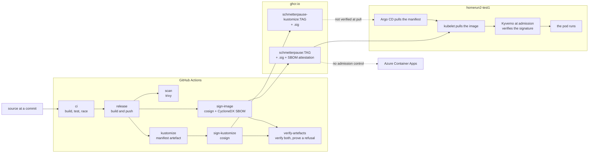

# Signatures, SBOM and what checks them

What runs should verifiably be what CI built, and something other than a human
should be the one checking. This page is the operator's side of that: what is
signed, how to check it by hand, what refuses an artefact that is not ours, and
what is deliberately not covered.

The decisions behind it are [ADR-0020](adr/0020-signieren-und-pruefen.md) and,
for how the pipeline does it, [ADR-0021](adr/0021-signieren-ueber-dagger-module.md).
The issues are [#230](https://github.com/stuttgart-things/schmetterpause/issues/230)
and [#254](https://github.com/stuttgart-things/schmetterpause/issues/254).

## At a glance

| | |
| --- | --- |
| Signature | keyless cosign — GitHub OIDC → Fulcio, recorded in Rekor |
| Signed by | `https://github.com/stuttgart-things/schmetterpause/.github/workflows/ci.yml@refs/*` |
| Issuer | `https://token.actions.githubusercontent.com` |
| Image | `ghcr.io/stuttgart-things/schmetterpause` — signature and CycloneDX SBOM attestation, both on the digest |
| Manifest artefact | `ghcr.io/stuttgart-things/schmetterpause-kustomize` — signature only |
| Tools | the `cosign`, `trivy`, `crane` and `kyverno` modules from [stuttgart-things/dagger](https://github.com/stuttgart-things/dagger), pinned in `Taskfile.yml` |
| Checked by | a Kyverno `ImageValidatingPolicy` at admission, the `verify-artefacts` job in CI, and the `policy-test` job for the policy itself |
| Not checked | Azure Container Apps, and every image that is not ours |
| First signed | the snapshot `3c7f3c7` on `main`, then the release `v0.9.0`; releases up to `v0.8.0` were published before anything was signed |

There is no key. Nothing to rotate, nothing in Vault, nothing to leak — and a
public record in the transparency log of every signature ever made, which for a
public package is the trade the project wanted. ADR-0020 has the reasoning.

## The chain, end to end

What CI builds, what signs it, and what checks it before it runs. Dashed edges
are the places nothing checks — they are drawn rather than left out, because a
picture that shows only the covered half is the failure this whole page exists
to avoid.


```mermaid
flowchart LR
    src["source at a commit"]

    subgraph ci["GitHub Actions"]
        direction TB
        build["ci<br/>build, test, race"]
        release["release<br/>build and push"]
        scan["scan<br/>trivy"]
        kust["kustomize<br/>manifest artefact"]
        signimg["sign-image<br/>cosign + CycloneDX SBOM"]
        signkust["sign-kustomize<br/>cosign"]
        verify["verify-artefacts<br/>verify both, prove a refusal"]

        build --> release
        release --> scan
        release --> signimg
        release --> kust
        kust --> signkust
        signimg --> verify
        signkust --> verify
    end

    subgraph reg["ghcr.io"]
        direction TB
        image["schmetterpause:TAG<br/>+ .sig + SBOM attestation"]
        artefact["schmetterpause-kustomize:TAG<br/>+ .sig"]
    end

    subgraph cluster["homerun2-test1"]
        direction TB
        argo["Argo CD pulls the manifest"]
        kubelet["kubelet pulls the image"]
        kyverno["Kyverno at admission<br/>verifies the signature"]
        pod["the pod runs"]

        argo --> kubelet
        kubelet --> kyverno
        kyverno --> pod
    end

    azure["Azure Container Apps"]

    src --> build
    signimg --> image
    signkust --> artefact
    artefact -.->|"not verified at pull"| argo
    image --> kubelet
    image -.->|"no admission control"| azure
```

Three things the picture is meant to make obvious:

- **Only one arrow into the pod is checked.** The image passes Kyverno; the
  manifest artefact Argo pulls does not, because the kubelet never pulls it and
  admission cannot see it. `verify-artefacts` covers it in CI instead, which is
  weaker by construction: it checks what we published, not what the cluster
  pulled.
- **Azure hangs off the registry with nothing in between.** That is #206, and
  the environment is temporary (ADR-0016).
- **Sigstore is on the signing path, not the verifying one.** Admission reads
  the signature from the registry and verifies the timestamp against a root
  embedded in Kyverno — measured on 2026-09-16, a signed image verified with the
  policy's `ctlog.url` pointing at a host that does not resolve (#262). So a
  Sigstore outage stops a *build*, never a deploy.

## Checking an artefact by hand

```sh
task verify:signature                    # the current VERSION, both artefacts
task verify:signature TAG=v0.9.0         # a particular release
```

That needs Dagger and nothing else: it calls the cosign module the pipeline
calls, at the version `Taskfile.yml` pins. A release up to `v0.8.0` fails it,
correctly — nothing was signed before `3c7f3c7`.

The long form, so that the two strings above are readable rather than buried in
a Taskfile:

```sh
dagger call -m github.com/stuttgart-things/dagger/cosign@v0.131.0 verify \
  --ref=ghcr.io/stuttgart-things/schmetterpause:v0.9.0 \
  --certificate-oidc-issuer=https://token.actions.githubusercontent.com \
  --certificate-identity-regexp='^https://github\.com/stuttgart-things/schmetterpause/\.github/workflows/ci\.yml@refs/'
```

With cosign installed, `cosign verify` takes the same two values as
`--certificate-oidc-issuer` and `--certificate-identity-regexp`.

Both are needed and neither is enough on its own. Anybody can get a certificate
from that issuer; the identity says which workflow file, in which repository,
asked for it. The module refuses to verify without an identity, and so does
cosign, for exactly this reason.

### The inventory

```sh
task verify:sbom                         # build/sbom.cdx.json
task verify:sbom TAG=v0.9.0 DEST=/tmp/sbom.json
```

Which is this, and it goes through `verify-attestation` rather than a plain
download on purpose: an inventory that cannot be traced back to the pipeline is
a list, not evidence. The module unwraps the attestation and returns the
predicate itself.

```sh
dagger call -m github.com/stuttgart-things/dagger/cosign@v0.131.0 verify-attestation \
  --ref=ghcr.io/stuttgart-things/schmetterpause:v0.9.0 \
  --predicate-type=cyclonedx \
  --certificate-oidc-issuer=https://token.actions.githubusercontent.com \
  --certificate-identity-regexp='^https://github\.com/stuttgart-things/schmetterpause/\.github/workflows/ci\.yml@refs/' \
  export --path=sbom.cdx.json
```

It is a CycloneDX document written by the trivy module's `Sbom`, against the
same digest the scan job reads and with the same trivy image, so the scan and
the inventory of one release come from one scanner.

**It describes `linux/amd64`.** The release is one manifest covering two
architectures, and an SBOM is per image, not per index. The arm64 image is
built from the same source on the same base; run by hand on 2026-09-15, the
module's arm64 inventory listed the same 32 packages. A second attestation for
arm64 is still an open point in ADR-0020.

## What checks it without being asked

### On the cluster: Kyverno

`policy/verify-image-signature.yaml` is an `ImageValidatingPolicy`
(`policies.kyverno.io/v1`), scoped to `schmetterpause` and
`schmetterpause-pr-*`. It refuses a pod whose
application image carries no signature from the identity above, whether the
pod names that image by tag or by digest, in a container or in an init
container. It names the signer with the same regexp as the verification above.

**On `homerun2-test1` the argocd catalog reconciles it.** The consumer sets
`policy.enabled` in `apps/schmetterpause/install`, whose child Application reads
this file from this repository at the same tag as the deployed release. The
policy on the cluster is therefore the one that release was tested against, and
a version bump moves app and policy together (stuttgart-things/argocd#446,
stuttgart-things/stuttgart-things#2982, live since 2026-09-15). For a cluster
outside that path:

```sh
task policy:apply
task policy:status
```

**A refusal reaches a human.** The pod is refused at admission, which whoever
deploys sees as a failed rollout. The same consumer's monitoring scrapes Kyverno
for this policy's results as well, and a failed verification raises an alert
through the cluster's Alertmanager to the Teams alert channel
(stuttgart-things/argocd#448, #449). Under `Audit` that alert was called
`SchmetterpauseUnsignedImageAdmitted`. Under `Deny` it has to say *refused*, and
the rename lands in the argocd catalog together with the version bump that
brings this policy, because the policy is read at the deployed tag. A
server-side dry-run counts as a refusal too; no Kyverno label tells the two
apart.

**It is in `Deny` from the release after v0.15.0.** It ran in `Audit` until it
had seen three clean releases, the posture Trivy took in this repository for
the same reason: a rule that has never run over a real release is a
measurement, not a verdict.

| Release | Result | Cluster | Date |
| --- | --- | --- | --- |
| `v0.9.0` | _none_ — the policy was applied on 2026-09-15 while that pod was already running, so it was never admitted through the check | homerun2-test1 | 2026-09-15 |
| `v0.10.0` | **pass** — PolicyReport on the pod and on the Deployment | homerun2-test1 | 2026-09-16 |
| `v0.11.0` | **pass** — PolicyReport on the pod and on the Deployment | homerun2-test1 | 2026-09-16 |
| `v0.12.0` | _not read_ — homerun2-test1 was torn down on 2026-09-28 before anybody read its report | homerun2-test1 | 2026-09-20 |
| `v0.13.0` | **pass** — pod `create` and `update` | homerun2-dev2 | 2026-09-28 |
| `v0.14.0` | **pass** — pod `create` and `update` | homerun2-dev2 | 2026-09-30 |
| `v0.15.0` | **pass** — pod `create` and `update` | homerun2-dev2 | 2026-10-05 |

`v0.10.0` is the first release this policy ever actually checked. `v0.9.0` is
listed as what it is, a release that ran under the policy without passing
through it, and is not counted.

**The homerun2-dev2 lines come from a metric, not from a PolicyReport.**
homerun2-dev2, the office's cluster since the move (stuttgart-things#3228),
carries no PolicyReport at all, for this policy or any other; read off the
cluster on 2026-10-06. What it does have is Kyverno's own counter
`kyverno_image_validating_policy_results_total`, scraped by the monitoring that
exists for the alert, with 15 days of retention. `increase(...[30m])` around
each rollout's ReplicaSet creation shows `pass` on `create` and on `update` for
v0.13.0 (2026-09-28 13:25Z), v0.14.0 (2026-09-30 11:29Z) and v0.15.0
(2026-10-05 22:20Z). Across the whole cluster the counter has no `fail` series,
and Kyverno's scrape was not down once in those ten days. The counter is what
the alert reads.

**Why homerun2-dev2 has no PolicyReport** (stuttgart-things#3488, read off the
cluster and the Kyverno v1.19.1 source on 2026-10-07). Two causes, one per mode:

- **Under `Audit` it was a stuck circuit breaker, not configuration.** Kyverno's
  admission controller writes an admission report only through a breaker that
  counts the existing admission reports through a watch, and treats a watch that
  has stopped as "open". The API server restarted on 2026-09-28 at 12:13Z, the
  watch did not come back, and the breaker has been open since. That was 44
  minutes before this policy reached the cluster. The admission controller's
  own metrics show it: `kyverno_breaker_drops_total{circuit_name="admission
  reports"}` equals `kyverno_breaker_total`, both 17. That is exactly the
  number of `Audit` results the policy produced (8 pod `create`, 3 pod
  `update`, 6 Deployment `update`). The controller never sent a single
  `create` for an `EphemeralReport` since it started on 2026-09-27. Reporting
  flags and RBAC are fine. Going by the source, restarting the admission
  controller starts a new watch and closes the breaker. That has not been
  tried. It is the platform's call, and it would not bring reports back for
  this policy, because:
- **Under `Deny` Kyverno writes no admission report for this kind of policy at
  all.** For `ImageValidatingPolicy` (and `ValidatingPolicy`) the handler skips
  the report as soon as the policy *has* the `Deny` action, whether the result
  is a pass or a fail (`pkg/webhooks/resource/ivpol/handler.go`, `audit()`).
  The only other source of reports is the background scan, and this policy
  turns it off (`evaluation.background.enabled: false`), so nothing re-checks
  signatures against GHCR every hour. Under `Deny` the instruments are
  therefore the counter, the alert, the failed `apply`, and a
  `PolicyViolation` event on the policy. The event lives in namespace `default`
  and expires with the cluster's event TTL. `task policy:status` shows both.

On homerun2-test1 the policy ran in `Audit` with a working breaker, which is
why the PolicyReports in the table above exist.

Five clean releases on two clusters, so the policy moved:

- `validationActions: [Audit]` became `[Deny]`;
- `mutateDigest` became `true`, so the pod carries the digest that was verified
  rather than the tag that resolved to it, and the kubelet cannot pull
  something else afterwards;
- `verifyDigest` stays `false`. It only demands that the reference already be a
  digest, which after `mutateDigest` holds by construction, so on the cluster it
  adds nothing. In the kyverno CLI, which does not run the mutation, it would
  report `signed-by-tag` as having no digest: measured on 2026-10-05 with
  `task policy:test`, all eight lines pass with it off and `signed-by-tag` fails
  with it on. Kept off, `policy/tests` still shows that a signed tag is
  admitted. That the rewrite really happens is checked on the cluster, in the
  drill below.

Kyverno 1.19.1 accepts `Deny` with `mutateDigest` in a server-side dry run.
What admission does with it on a real refusal is the drill below, run again
under `Deny`.

Three things to know about it:

- `failurePolicy: Ignore`, and it stays `Ignore` under `Deny` (#262, decided
  2026-09-16). While the webhook cannot answer, the pod is admitted unchecked
  rather than refused. `Fail` was rejected because it would let a GHCR outage
  stop every schmetterpause pod, the first one on a rebuilt cluster included
  (`docs/backup-restore.md`). The hole is not silent:
  `SchmetterpauseSignatureCheckSkipped` fires on the API server's fail-open
  counter (stuttgart-things/argocd#457). `Deny` changes what a failed
  *verification* does, not what a failed *webhook* does.
- **Admission reaches GHCR and nothing else.** Not Rekor and not Sigstore's TUF
  root: measured on `homerun2-test1` on 2026-09-16 with `ctlog.url` pointed at
  a host that does not resolve. The signed probe still passed and the unsigned
  one still failed. That holds because the signature CI makes carries a
  `SignedEntryTimestamp` bundle, which Kyverno verifies offline against the
  Rekor key it ships with (`enableTuf=false`). **Do not drop the bundle from
  signing.** A signature without it sends verification to the online Rekor
  lookup, and then `rekor.sigstore.dev` is on the admission path.
- The policy covers the application image only. Postgres, and anything else in
  the same namespace, is not checked by it and is not claimed to be — and
  nothing stops a pod there from running a different image altogether.

### The policy itself: the `policy-test` job

`policy/tests/kyverno-test.yaml` lists the pods the policy must refuse — an
unsigned image by tag, by digest, by tag and digest, in an init container and
in a preview namespace — and the pods it must admit: a signed image by tag and
by digest, and a pod running only Postgres. The `policy-test` job runs
`kyverno test` over it on every change, through the kyverno module, with the
Kyverno release `homerun2-test1` runs (`KYVERNO_VERSION` in the Taskfile) and
with warnings as errors, so a deprecated policy kind fails before the cluster
stops accepting it.

```sh
task policy:test
```

It needs the network, because the policy checks signatures while it is tested,
and it depends on two published releases staying published: `v0.8.0`
(unsigned) and `v0.9.0` (the first signed one). `policy/tests/pods.yaml` says
why each.

What it cannot show is that a pod outside the two namespaces is left alone:
Kyverno produces no result for a resource it does not match, and `kyverno test`
counts a missing result as a failure.

### In the delivery path: the `verify-artefacts` job

The kustomize artefact is what Argo consumes, and admission never sees it — the
kubelet does not pull it. So for that half, the check is a CI job:
`verify-artefacts` in `.github/workflows/ci.yml` verifies both artefacts after
they are signed, through the cosign module, prints the certificate subject it
found, and fails the build if either does not verify.

It is weaker than admission by construction: it checks the thing we published,
not the thing the cluster pulled. Closing that would mean a policy engine in
front of Argo's OCI pull, which nothing in this org runs today — an open point
in ADR-0020.

## Proving it can refuse

> A verification that has never refused anything is indistinguishable from one
> that cannot.

Two halves, because one of them needs a cluster and one does not.

**Every build.** The last step of `verify-artefacts` runs the cosign module's
`verify-refuses` against an identity that must not match, for the signature and
for the SBOM attestation. It succeeds only when cosign refuses *because the
identity does not match*: a missing signature or an unreachable registry fails
it as well, so it cannot pass by failing for the wrong reason. It catches the
failure mode the drill below is for — an identity pattern that quietly matches
everything would sail through the step above it and keep doing so forever.

And the four places that name the signer — this page, the pipeline, the
Taskfile and the policy — are compared against each other by
`scripts/signing_test.sh`, which runs in the pipeline's lint stage
(`task signing:check` locally). Widening one of them is the quiet way this
stops being a gate. The test also fails if the policy names more than one
signer: its identities are alternatives, so a second entry beside the right one
widens the gate without making any single line look wrong.

**By hand, against the cluster: the drill, as recorded.** DoD point 5 asks for
a refusal that something other than a human catches, and that reaches a human.
It was run on `homerun2-test1` on 2026-09-15, under `Audit`. It used the
released, unsigned `v0.8.0` rather than a scratch tag, so nothing had to be
pushed to the release repository or deleted from it afterwards.

| Time (Z) | What happened | After creation |
| --- | --- | --- |
| 14:36:29 | `kubectl apply` of the pod `signature-drill`: image `…/schmetterpause:v0.8.0`, no app label, a command that does not exist. Admitted, as `Audit` must | 0 s |
| 14:36:33 | Kyverno: `image verification failed … failed to verify cosign signatures: no signatures found` | 4 s |
| 14:37:12 | `kyverno_image_validating_policy_results_total{result="fail"}` went from 1 to 2 in Prometheus. `PolicyReport` for the pod: `fail`, severity `high`, *the application image is not signed by the schmetterpause CI workflow* | 43 s |
| 14:37:21 | Alertmanager: `SchmetterpauseUnsignedImageAdmitted` active, `resource_namespace=schmetterpause` | 52 s |
| 14:37:51 | The notification-catcher caught it for Teams, and a person confirmed the card in the Teams alert channel | 82 s |
| 14:52:51 | Alertmanager had resolved the alert at 14:51:47, and the catcher caught the green "Resolved:" card. The rule held its full 15-minute window; before stuttgart-things/argocd#449 it resolved one minute after firing | 16 min 22 s |

The pod was deleted at 14:38:25. Its `PolicyReport` went with it, and the
office pod was not touched.

**The drill again, under `Deny`.** Run on `homerun2-dev2` on 2026-10-07, after
v0.16.0 reached the cluster through catalog v0.71.0, with the same pod as above:

| Time (UTC) | What | |
| --- | --- | --- |
| 04:49 | The v0.16.0 app pod, admitted under `Deny`, runs `…/schmetterpause:v0.16.0@sha256:10e1a97e…`: `mutateDigest` rewrote the tag to the digest it verified | — |
| 04:50:36 | `kubectl apply` of `signature-drill` (unsigned `v0.8.0`) | 0 s |
| 04:50:40 | **Refused.** `admission webhook "ivpol.validate.kyverno.svc-ignore-finegrained-schmetterpause-verify-image-signature" denied the request: … the application image is not signed by the schmetterpause CI workflow`. No pod exists afterwards, so there is nothing to delete | 4 s |
| 04:50:54 | `SchmetterpauseUnsignedImageRefused` **firing** in Prometheus, `resource_namespace=schmetterpause`; `kyverno_image_validating_policy_results_total{result="fail",resource_request_operation="create"}` is 1 | 18 s |
| 04:51 | The same alert active in Alertmanager, routed to the receiver `webhook` (the path to the Teams channel) | ~25 s |
| later | The card in the Teams alert channel: *"Resolved: An image not signed by the schmetterpause CI workflow was refused"*, tags `cluster=homerun2-dev2`, `resource_namespace=schmetterpause`, start time 04:50:54. One client showed it as `cards.unsupported` (no plain-text fallback, fixed in homerun2-notification-catcher v3.0.3, stuttgart-things/stuttgart-things#3490) | — |

Both things the first drill could not show are now watched: the `apply` itself
fails and names the policy, and the admitted application pod carries a digest.
The refusal reached the Teams channel as well.

Under `Deny` no cluster writes a PolicyReport for this policy (see above), so
the refusal is read from the `apply`, from the alert and from the
`PolicyViolation` event that `task policy:status` lists. To repeat it:

```sh
kubectl apply -f - <<'EOF'
apiVersion: v1
kind: Pod
metadata:
  name: signature-drill
  namespace: schmetterpause
  labels: { purpose: signature-drill }
spec:
  restartPolicy: Never
  activeDeadlineSeconds: 120
  automountServiceAccountToken: false
  containers:
    - name: drill
      image: ghcr.io/stuttgart-things/schmetterpause:v0.8.0
      command: ["/nonexistent-drill"]
EOF
# expected: "denied the request", and no pod afterwards
kubectl -n schmetterpause get pods \
  -o jsonpath='{range .items[*]}{.metadata.name}{"\t"}{.spec.containers[*].image}{"\n"}{end}'
# expected: the application image ends in @sha256:…
```

## Where this does not reach

- **Azure Container Apps.** No admission control exists there at all (#206),
  so nothing on that side checks a signature before starting a container. The
  image is verified in CI and nowhere else. The environment is temporary
  (ADR-0016) and this is the reason it is named rather than quietly left out:
  covering one of two environments while sounding like coverage is the failure
  this whole piece of work exists to avoid.
- **Argo's pull of the kustomize artefact.** See above.
- **Everything below the signature.** A signature says the artefact came from
  this workflow. It says nothing about whether what the workflow built was
  right, which is what the tests, the scans and the reviews are for. It also
  says nothing about the base image, which is somebody else's signature to
  check and is not checked here.
- **The signatures of pull-request builds are not swept.**
  `cleanup-pr-artifacts.yml` deletes versions tagged `pr-<n>-*`; cosign stores
  a signature under `sha256-<digest>.sig`, which does not match that pattern.
  So a closed pull request leaves two small objects behind per build. Noted
  rather than fixed — it needs a change in a shared workflow this repository
  does not own, and it is an open point in ADR-0020.
